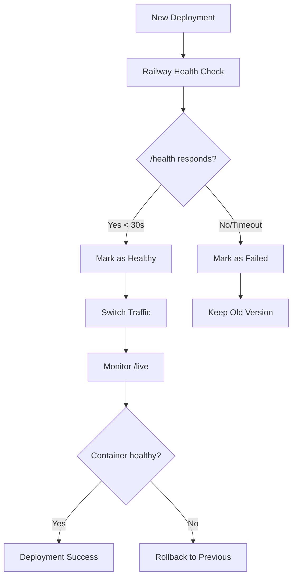

# Railway Blue-Green Deployment Strategy for TaxPoynt Backend

## Overview

This document outlines the comprehensive DevOps strategy for resolving Railway health check issues and implementing a robust Blue-Green deployment approach for the TaxPoynt eInvoice backend.

## Problem Analysis

### Root Causes of Health Check Failures

1. **Complex Startup Checks**: Existing health checks performed extensive database, Redis, and service validation during Railway's deployment window
2. **Import Dependencies**: Health checks relied on modules that might not be loaded during early startup phases
3. **CRM Integration Issues**: Salesforce router and CRM integrations caused startup failures
4. **Timeout Issues**: Railway has strict timeouts for health check responses (<30 seconds)
5. **Blue-Green Requirements**: Railway needs fast, reliable health checks for proper traffic switching

## Solution Architecture

### 1. Railway-Optimized Health Check System

**File**: `backend/app/api/routes/health_railway.py`

#### Health Check Endpoints

| Endpoint | Purpose | Timeout | Railway Usage |
|----------|---------|---------|---------------|
| `/` | Root health check | <100ms | Load balancer probe |
| `/health` | Basic health check | <100ms | Deployment validation |
| `/ready` | Readiness probe | <200ms | Traffic switching decision |
| `/live` | Liveness probe | <500ms | Container restart decision |
| `/startup` | Startup probe | <2s | Initial deployment validation |
| `/detailed` | Operational monitoring | <5s | Dashboard/alerts only |
| `/metrics` | Metrics for monitoring | <200ms | External monitoring |

#### Key Features

- **Ultra-fast responses**: All critical endpoints respond in <200ms
- **Graceful fallbacks**: Never fail deployment due to non-critical issues
- **Caching**: 30-second cache for expensive operations
- **Timeout protection**: Async timeouts prevent hanging
- **Railway-specific optimizations**: Designed for Railway's deployment flow

### 2. Startup Management System

**File**: `backend/scripts/railway_startup.py`

#### Startup Sequence

1. **Environment Validation** (Critical)
   - Check required environment variables
   - Validate Railway-specific configuration

2. **Critical Module Preloading** (Critical)
   - Import essential modules early
   - Catch import errors before server start

3. **Database Connection** (Non-critical)
   - Test database connectivity with retries
   - Don't fail deployment if database is temporarily unavailable

4. **Redis Connection** (Non-critical)
   - Test Redis connectivity
   - Continue without Redis if unavailable

5. **Application Initialization** (Critical)
   - Initialize FastAPI application
   - Verify core components

6. **Background Services** (Non-critical)
   - Start background tasks
   - Continue without background services if they fail

#### Graceful Failure Handling

```python
# Example of graceful failure handling
try:
    success = step_func()
    if success:
        logger.info(f"✓ {step_name} completed")
    else:
        # Only fail deployment for critical steps
        if step_name in ["Environment Validation", "Application Initialization"]:
            return False
        else:
            logger.warning(f"Continuing despite {step_name} failure")
except Exception as e:
    # Same logic for exceptions
    if step_name in critical_steps:
        return False
    else:
        logger.warning(f"Continuing despite {step_name} exception")
```

### 3. Railway Configuration

**File**: `railway.json`

```json
{
  "build": {
    "builder": "nixpacks",
    "buildCommand": "cd backend && pip install --no-cache-dir -r requirements.txt"
  },
  "deploy": {
    "startCommand": "cd backend && python scripts/railway_startup.py",
    "healthcheckPath": "/health",
    "healthcheckTimeout": 30,
    "restartPolicyType": "ON_FAILURE",
    "restartPolicyMaxRetries": 3
  }
}
```

## Blue-Green Deployment Process

### 1. Health Check Flow



### 2. Traffic Switching Strategy

1. **Zero-Downtime Deployment**
   - Railway keeps old version running during deployment
   - New version starts and passes health checks
   - Traffic gradually switches to new version
   - Old version shuts down after successful switchover

2. **Health Check Validation**
   - `/health` must respond within 30 seconds
   - `/ready` confirms application is ready for traffic
   - `/live` monitors ongoing container health

3. **Automatic Rollback**
   - If new version fails health checks, traffic stays on old version
   - If new version fails after deployment, Railway can auto-rollback
   - Manual rollback available via Railway dashboard

### 3. Environment-Specific Configuration

#### Production Environment

```bash
# Railway Environment Variables
APP_ENV=production
WORKERS=1
TIMEOUT_KEEP_ALIVE=300
GRACEFUL_TIMEOUT=120
MAX_REQUESTS=1000
MAX_REQUESTS_JITTER=100

# Health Check Configuration
HEALTH_CHECK_TIMEOUT=30
STARTUP_TIMEOUT=120
SHUTDOWN_TIMEOUT=60
```

#### Staging Environment

```bash
# Railway Environment Variables
APP_ENV=staging
WORKERS=1
TIMEOUT_KEEP_ALIVE=300
DEBUG_HEALTH_CHECKS=true
```

## Implementation Steps

### Step 1: Deploy Railway-Optimized Health Checks

```bash
# 1. Commit the new health check system
git add backend/app/api/routes/health_railway.py
git add backend/scripts/railway_startup.py
git add railway.json
git add docs/Railway_Blue_Green_Deployment_Strategy.md

# 2. Update main application
git add backend/app/main.py

# 3. Commit changes
git commit -m "feat: implement Railway-optimized health checks for Blue-Green deployment"

# 4. Push to trigger Railway deployment
git push origin master
```

### Step 2: Configure Railway Service

1. **Update Railway Service Settings**
   ```bash
   # In Railway dashboard or CLI
   railway service update --healthcheck-path /health --healthcheck-timeout 30
   ```

2. **Set Environment Variables**
   ```bash
   railway variables set APP_ENV=production
   railway variables set WORKERS=1
   railway variables set TIMEOUT_KEEP_ALIVE=300
   ```

3. **Configure Deployment Settings**
   - Enable health checks in Railway dashboard
   - Set restart policy to "ON_FAILURE"
   - Configure maximum retries to 3

### Step 3: Validate Deployment

1. **Test Health Check Endpoints**
   ```bash
   # Basic health check
   curl https://your-railway-app.railway.app/health
   
   # Readiness check
   curl https://your-railway-app.railway.app/ready
   
   # Detailed health check
   curl https://your-railway-app.railway.app/detailed
   ```

2. **Monitor Deployment Logs**
   ```bash
   railway logs --follow
   ```

3. **Verify Blue-Green Deployment**
   - Deploy a test change
   - Observe zero-downtime switchover
   - Confirm health checks pass consistently

## Monitoring and Alerting

### 1. Health Check Monitoring

```bash
# Monitor health check response times
curl -w "@curl-format.txt" -o /dev/null -s https://your-app.railway.app/health

# Check detailed health status
curl https://your-app.railway.app/detailed | jq '.health_score'
```

### 2. Key Metrics to Monitor

- **Health Check Response Time**: Should be <200ms
- **Health Check Success Rate**: Should be >99.9%
- **Deployment Success Rate**: Should be >95%
- **Rollback Frequency**: Should be <5% of deployments

### 3. Alerting Rules

```yaml
# Example alerting configuration
alerts:
  - name: health_check_failing
    condition: health_check_success_rate < 95%
    for: 5m
    action: notify_devops_team
    
  - name: deployment_failure
    condition: deployment_success_rate < 90%
    for: 1m
    action: notify_devops_team_urgent
    
  - name: high_response_time
    condition: health_check_response_time > 1000ms
    for: 3m
    action: investigate_performance
```

## Troubleshooting Guide

### Common Issues and Solutions

#### 1. Health Check Timeouts

**Symptoms**: Railway deployment fails with health check timeout
**Solution**:
```bash
# Check if health endpoint is accessible
curl -v https://your-app.railway.app/health

# Check application logs for startup issues
railway logs --tail 100

# Verify environment variables are set
railway variables list
```

#### 2. Import Module Errors

**Symptoms**: Application fails to start due to missing modules
**Solution**:
```bash
# Check requirements.txt includes all dependencies
pip freeze > requirements-freeze.txt
diff requirements.txt requirements-freeze.txt

# Rebuild with clean cache
railway service restart --force-rebuild
```

#### 3. Database Connection Issues

**Symptoms**: Health checks fail due to database connectivity
**Solution**:
```python
# Health checks are designed to be non-blocking for database issues
# Check /detailed endpoint for specific database status
curl https://your-app.railway.app/detailed | jq '.checks.database'
```

#### 4. CRM Integration Startup Failures

**Symptoms**: Application fails during CRM router initialization
**Solution**:
```python
# CRM routers are now wrapped in try-catch blocks
# Check logs for specific CRM integration errors
railway logs --filter "crm"

# Temporarily disable problematic CRM integrations
railway variables set DISABLE_SALESFORCE_ROUTER=true
```

### Recovery Procedures

#### 1. Emergency Rollback

```bash
# Immediate rollback to previous version
railway service rollback

# Or rollback to specific deployment
railway service rollback --deployment-id <deployment-id>
```

#### 2. Health Check Bypass (Emergency Only)

```bash
# Temporarily disable health checks (emergency only)
railway service update --no-healthcheck

# Re-enable after fixing issues
railway service update --healthcheck-path /health
```

#### 3. Blue-Green Deployment Reset

```bash
# Force new deployment with clean state
railway service restart --force-rebuild --no-cache
```

## Best Practices

### 1. Health Check Design

- **Keep it simple**: Health checks should be as minimal as possible
- **Fail gracefully**: Never fail deployment for non-critical issues
- **Cache expensive operations**: Use caching for database/external API checks
- **Set timeouts**: Always use timeouts to prevent hanging
- **Log appropriately**: Log warnings but don't fail on minor issues

### 2. Deployment Strategy

- **Test in staging first**: Always validate health checks in staging environment
- **Monitor during deployment**: Watch health check metrics during deployment
- **Have rollback plan**: Always be prepared to rollback quickly
- **Gradual rollout**: Consider feature flags for major changes

### 3. Error Handling

- **Graceful degradation**: Continue operating with reduced functionality if needed
- **Clear error messages**: Provide actionable error messages in logs
- **Circuit breakers**: Implement circuit breakers for external dependencies
- **Retry logic**: Use exponential backoff for transient failures

## Conclusion

This Railway Blue-Green deployment strategy provides:

1. **Reliable Health Checks**: Fast, Railway-optimized health checks that prevent deployment timeouts
2. **Graceful Startup**: Robust startup sequence that handles failures gracefully
3. **Zero-Downtime Deployments**: Proper Blue-Green deployment with automatic rollback
4. **Comprehensive Monitoring**: Complete observability into deployment health
5. **Emergency Procedures**: Clear recovery procedures for common issues

The implementation ensures that the TaxPoynt backend can reliably deploy on Railway while maintaining high availability for FIRS-Sandbox endpoint testing and production operations.