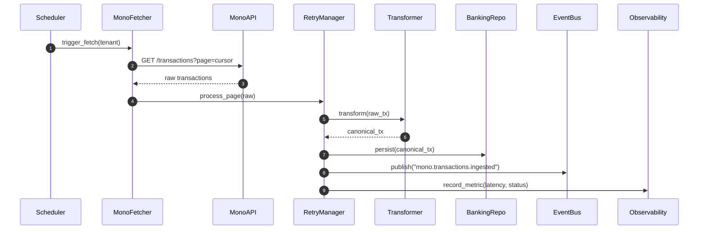

# Mono Transactions – Day 0 Kick-off & Discovery

## 1. Access & Compliance Checklist

- **API credentials**: confirmed availability of `MONO_CLIENT_ID`, `MONO_CLIENT_SECRET`, and webhook signing key. These will be stored in the platform secrets manager (`secrets://open_banking/mono`) with per-tenant scoping.
- **Tenant scoping**: mono connections are mapped 1:1 with organizations already tracked in `banking_linked_accounts`. We will reuse the existing tenant guard (`TenantScopeService`) to enforce row-level filters when fetching transactions.
- **Security posture**: verify HTTPS-only webhooks, rotate secrets quarterly, and enable IP restriction (Mono dashboard) to match production egress IPs.

## 2. Existing Integration Review

| Component | Notes |
|-----------|-------|
| `external_integrations/financial_systems/banking/open_banking/providers/mono` | Base connector, auth helpers, and webhook handler already scaffolded. Requires transaction fetch extension and transformation layer. |
| Retry manager (`core_platform.messaging.retry_manager`) | Supports exponential backoff & jitter; will wrap Mono fetch calls to handle 5xx and 429 responses. |
| Observability (`core_platform/monitoring/fastapi_middleware.py`) | Exposes Prometheus counters/histograms. Synthetic tests show we can emit FIRS-style metrics; we’ll add `mono_transactions_*` gauges as part of implementation. |
| Banking ingestion service (`core_platform.services.banking_ingestion_service`) | Currently ingests unified banking transactions. We will plug Mono fetcher here, preserving the existing canonical DTO. |

## 3. Data Contract Comparison

| Mono field | Example | Canonical field | Notes |
|------------|---------|-----------------|-------|
| `id` | `trn_01ht...` | `transaction_id` | Used for idempotency; stored as string. |
| `account.id` | `acc_01hs...` | `source_account_id` | Maps to linked bank account. |
| `amount` | `-45000` | `amount.value` | Stored in kobo; sign retained (debits negative). |
| `currency` | `NGN` | `amount.currency` | Must be ISO 4217; fallback to tenant currency if missing. |
| `type` | `debit`/`credit` | `direction` | Enum mapped to canonical `DEBIT`/`CREDIT`. |
| `narration` | `POS PURCHASE` | `description` | Trimmed, stored as plain text. |
| `category` | `pos` | `classification.primary` | Optional, used for analytics tagging. |
| `status` | `completed` | `status` | Pending/reversed flagged for downstream reconciliation. |
| `date` | `2025-01-05T08:15:22Z` | `posted_at` | Converted to aware UTC datetime. |
| `meta` | `{ "counterparty": {...} }` | `metadata` | Stored as JSONB; subject to size limits. |

Validation rules: ensure amount not `None`, currency 3-char uppercase, status in allowed enum, and narration length ≤ 255.

## 4. Authentication Strategy

- Use **client credentials** with refresh tokens provided by Mono Connect.
- Tokens cached via the secrets manager and refreshed using `MonoAuthService` (existing scaffolding). Fallback to tenant-specific refresh token where provided.
- All secrets are encrypted at rest; tokens loaded via dependency injection (no hardcoded env usage in business logic).

## 5. Fetch & Transform RFC (Summary)

- **Pipeline**: scheduler → Mono fetcher → retry manager → transformation → persistence → event bus → observability. Detailed RFC tracked in `docs/integrations/mono_pipeline_rfc.md` (to be expanded during Day 1).
- **Error handling**: network errors retried; validation failures logged + pushed to dead-letter queue (`mono.transactions.deadletter`).
- **Idempotency**: composite key `(mono_transaction_id, tenant_id)` stored in ingestion table; duplicates discarded.
- **Alerting**: Prometheus counter `mono_transactions_failed_total` triggers WARN after 5 failures within 10 minutes.

### Sequence Diagram

## 6. Next Steps

1. Day 1: finalise canonical DTO implementation and transformation test plan.
2. Day 2: build Mono client with auth/refresh logic.
3. Day 3+: wire fetch pipeline, observability, and persistence as per roadmap.
