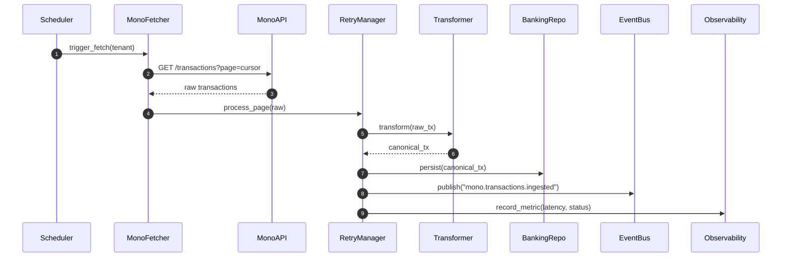

# Mono Transactions – Day 0 Kick-off & Discovery

## 1. Access & Compliance Checklist

- **API credentials**: confirmed availability of `MONO_CLIENT_ID`, `MONO_CLIENT_SECRET`, and webhook signing key. These will be stored in the platform secrets manager (`secrets://open_banking/mono`) with per-tenant scoping.
- **Tenant scoping**: connections map 1:1 with `banking_linked_accounts`; reuse `TenantScopeService` to enforce row-level filters.
- **Security posture**: enforce HTTPS-only webhooks, rotate secrets quarterly, and whitelist production egress IPs in the Mono dashboard.

## 2. Existing Integration Review

| Component | Notes |
|-----------|-------|
| `external_integrations/.../providers/mono` | Connector/auth scaffolding in place; transaction fetch/transform to be extended. |
| Retry manager | `core_platform.messaging.retry_manager` handles backoff/jitter; wrap Mono API calls. |
| Observability | `core_platform/monitoring/fastapi_middleware.py` provides Prometheus hooks; extend with `mono_transactions_*`. |
| Banking ingestion service | `core_platform.services.banking_ingestion_service` consumes canonical DTO; Mono pipeline will plug into this entry point. |

## 3. Data Contract Comparison

| Mono field | Canonical field | Notes |
|------------|-----------------|-------|
| `id` | `BankTransaction.id` | Primary idempotency key. |
| `account.id` | `provider_account_id` | Stored with `account_number` for traceability. |
| `account.account_number` | `account_number` | Normalised string. |
| `amount` | `amount` | Absolute decimal; direction set via `transaction_type`. |
| `currency` | `currency` | Defaults to account currency when missing. |
| `type` | `transaction_type` | `credit`/`debit`. |
| `status` | `status` | Supported: completed/pending/reversed. |
| `balance` | `ledger_info.ledger_balance` | Optional snapshot. |
| `narration` | `narration` | Long-form description. |
| `description` | `description` | Short description; fallback to narration. |
| `meta.counterparty.*` | `counterparty.*` | Nested counterparty info. |
| `meta.tags` | `tags` | Lowercased/deduplicated. |
| `date` | `transaction_date` | UTC aware datetime. |
| `value_date` | `value_date` | Optional. |
| `meta.is_reversal` | `is_reversal` | Falls back to `status == "reversed"`. |

Validation rules: non-negative amount, 3-letter currency, constrained statuses, zero amounts flagged as holds, duplicate detection `(id, provider_account_id, transaction_date)`.

## 4. Authentication Strategy

- Use client credentials with Mono refresh tokens. Tokens stored in secrets manager, loaded via dependency injection in the connector.
- Secrets encrypted at rest; no raw env references inside business logic.

## 5. Fetch & Transform RFC (Summary)

- Pipeline: scheduler → Mono fetcher → retry manager → transform → persistence → event bus → observability. RFC tracked in `docs/integrations/mono_pipeline_rfc.md`.
- Errors retried with backoff; validation failures routed to `mono.transactions.deadletter`.
- Idempotency enforced with composite key `(mono_transaction_id, tenant_id)`.
- Prometheus counter `mono_transactions_failed_total` emits WARN after 5 failures in 10 minutes.

### Sequence Diagram

## 6. Next Steps

1. Day 1: canonical DTO & transformation tests.
2. Day 2: Mono client + auth flow (current task).
3. Day 3+: fetch pipeline, observability, persistence integrations.
