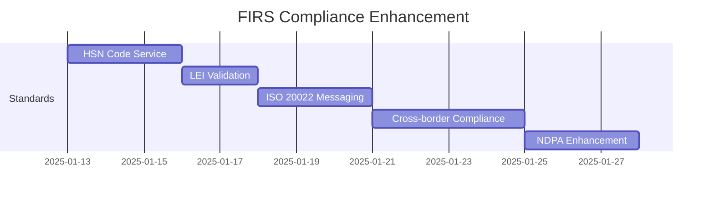
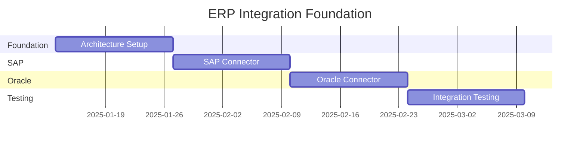
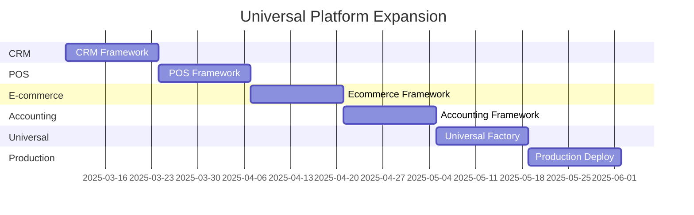

# 🚀 TaxPoynt Universal Integration Platform - Complete Implementation Plan

**Document Version**: 1.0  
**Created**: January 2025  
**Project Timeline**: 30 weeks (7.5 months)  
**Strategic Vision**: Transform TaxPoynt from FIRS e-invoicing solution to Nigeria's definitive business integration platform  

---

## 🎯 **Executive Summary**

This comprehensive implementation plan combines three strategic initiatives into a unified roadmap:

1. **Professional ERP Integration Strategy** (8 weeks)
2. **Universal Platform Expansion** (12 weeks) 
3. **FIRS Compliance Enhancement** (ongoing)

**Expected Outcome**: 700% revenue increase within 21 months through market-leading FIRS-compliant comprehensive integration platform.

---

## 📋 **Phase Overview**

### **Phase 0: FIRS-Compliant Architecture Migration** (Weeks 1-10)
- Implement complete role-separated architecture (SI/APP/Hybrid/Core)
- Achieve 100% FIRS compliance with clear role boundaries
- Implement critical standards (HSN, LEI, ISO 20022, NDPA)
- Establish universal connector framework foundation

### **Phase 0: FIRS-Compliant Architecture Migration** (Weeks 1-10)
- Complete role-separated architecture implementation (SI/APP/Hybrid)
- Critical compliance standards (HSN, LEI, ISO 20022, NDPA)
- Foundation services and universal connector framework
- Target: 100% FIRS compliance

### **Phase 1: Enterprise ERP Foundation** (Weeks 11-18)
- SAP S/4HANA integration with mock-first approach
- Oracle ERP Cloud integration  
- Enhanced architecture with abstract base classes
- Target: 40% revenue increase

### **Phase 2: Universal Platform Expansion** (Weeks 19-30)
- CRM integrations (Salesforce, HubSpot, Zoho)
- POS systems (Square, Shopify POS, Lightspeed)
- E-commerce platforms (Shopify, WooCommerce)
- Accounting software (QuickBooks, Xero)
- Target: 300% total revenue increase

---

## 🏗️ **FIRS-Compliant Technical Architecture Overview**

### **Final Target Architecture - Role-Separated Structure**
```
taxpoynt_platform/
├── si_services/                   # 🔧 SYSTEM INTEGRATOR ROLE
│   ├── document_processing/          # Invoice & Document Management
│   ├── data_extraction/              # ERP Data Extraction  
│   ├── transformation/               # Data Transformation
│   ├── schema_compliance/            # Schema Validation
│   ├── certificate_management/       # Digital Certificates (SI Role)
│   ├── irn_qr_generation/           # IRN & QR Code Generation
│   ├── integration_management/       # System Integration Management
│   └── reporting/                    # SI Reporting
├── app_services/                  # 🚀 ACCESS POINT PROVIDER ROLE
│   ├── firs_communication/          # FIRS API Communication
│   ├── transmission/                # Document Transmission
│   ├── validation/                  # Pre-Submission Validation
│   ├── authentication_seals/        # Authentication Seal Management
│   ├── security_compliance/         # Security & Compliance (APP Role)
│   ├── status_management/           # Submission Status Management
│   ├── webhook_services/            # Webhook Management
│   └── reporting/                   # APP Reporting
├── hybrid_services/               # 🤝 SHARED SI+APP SERVICES
│   ├── workflow_orchestration/      # End-to-End Workflows
│   ├── compliance_coordination/     # Unified Compliance
│   ├── data_synchronization/        # Cross-Role Data Sync
│   ├── error_management/            # Unified Error Handling
│   ├── configuration_management/    # Unified Configuration
│   └── analytics_aggregation/       # Cross-Role Analytics
├── core_platform/                 # 🏛️ FOUNDATION SERVICES
│   ├── authentication/             # Authentication & Authorization
│   ├── data_management/             # Data Foundation
│   ├── messaging/                   # Event-Driven Communication
│   ├── monitoring/                  # Observability
│   ├── security/                    # Platform Security
│   └── infrastructure/             # Infrastructure Management
├── external_integrations/         # 🔗 THIRD-PARTY SYSTEM CONNECTORS
│   ├── connector_framework/        # Universal Connector Framework
│   ├── business_systems/           # Business System Connectors
│   │   ├── erp/                        # ERP Systems (Phase 1)
│   │   ├── crm/                        # CRM Systems (Phase 2)
│   │   ├── pos/                        # POS Systems (Phase 2)
│   │   ├── ecommerce/                  # E-commerce Platforms (Phase 2)
│   │   ├── accounting/                 # Accounting Software (Phase 2)
│   │   └── inventory/                  # Inventory Management (Phase 2)
│   ├── financial_systems/          # Financial & Payment Systems
│   ├── logistics_systems/          # Logistics & Delivery
│   └── regulatory_systems/         # Regulatory & Compliance
├── api_gateway/                   # 🌐 UNIFIED API LAYER
│   ├── role_routing/               # Role-Based Request Routing
│   ├── api_versions/               # API Version Management
│   ├── middleware/                 # Request Processing Middleware
│   ├── documentation/              # Role-Aware Documentation
│   └── monitoring/                 # API Monitoring
└── frontend/                      # 🖥️ ROLE-AWARE USER INTERFACE
    ├── role_management/            # Role-Based UI Management
    ├── si_interface/               # System Integrator Interface
    ├── app_interface/              # Access Point Provider Interface
    ├── hybrid_interface/           # Shared SI+APP Interface
    ├── shared_components/          # Reusable Components
    └── localization/               # Multi-Language Support
```

---

## 🏗️ **Phase 0: FIRS-Compliant Architecture Migration (Weeks 1-10)**

*This phase replaces the original Phase 0 and implements the FIRS-compliant role-separated architecture from FIRS_COMPLIANT_ARCHITECTURE_RECALIBRATION.md*

### **Week 1-2: Foundation Setup**

#### **FIRS Role-Based Structure Creation**
```bash
# Create new FIRS role-based structure
mkdir -p taxpoynt_platform/{si_services,app_services,hybrid_services,core_platform}
mkdir -p taxpoynt_platform/{external_integrations,api_gateway,frontend}

# Migrate existing FIRS services with role alignment
cp -r backend/app/services/firs_si/* taxpoynt_platform/si_services/
cp -r backend/app/services/firs_app/* taxpoynt_platform/app_services/
cp -r backend/app/services/firs_hybrid/* taxpoynt_platform/hybrid_services/
cp -r backend/app/services/firs_core/* taxpoynt_platform/core_platform/
```

#### **SI Services Foundation**
```python
# si_services/document_processing/invoice_generator.py
class HSNCodeService:
    """
    Global Harmonized System of Nomenclature (HSN) code support
    for cross-border e-invoicing compliance
    """
    
    def __init__(self):
        self.hsn_database = self._load_global_hsn_codes()
        self.country_mappings = self._load_country_mappings()
    
    def validate_hsn_code(self, hsn_code: str, country: str = "NG") -> bool:
        """Validate HSN code for specific country"""
        pass
    
    def get_hsn_description(self, hsn_code: str) -> str:
        """Get product description for HSN code"""
        pass
    
    def map_hsn_to_local_code(self, hsn_code: str, target_country: str) -> str:
        """Map global HSN to local product classification"""
        pass
    
    def get_cross_border_requirements(self, hsn_code: str) -> dict:
        """Get additional requirements for cross-border transactions"""
        pass
```

#### **Day 3-4: LEI Validation Service**
```python
# firs_core/compliance_standards/lei_validation_service.py
class LEIValidationService:
    """
    Legal Entity Identifier (LEI) validation service
    for business entity compliance
    """
    
    def __init__(self):
        self.lei_api_endpoint = "https://api.gleif.org/api/v1/lei-records"
        self.cache = {}
    
    async def validate_lei(self, lei_code: str) -> dict:
        """Validate LEI code against GLEIF database"""
        pass
    
    async def get_entity_info(self, lei_code: str) -> dict:
        """Get entity information from LEI"""
        pass
    
    def is_lei_required(self, transaction_amount: float, countries: list) -> bool:
        """Check if LEI is required for transaction"""
        pass
    
    async def suggest_lei_registration(self, company_data: dict) -> dict:
        """Suggest LEI registration process"""
        pass
```

#### **Day 5-7: ISO 20022 Financial Messaging**
```python
# firs_core/compliance_standards/iso20022_messaging.py
class ISO20022MessagingService:
    """
    ISO 20022 financial messaging standards support
    for enhanced financial transaction processing
    """
    
    def __init__(self):
        self.message_templates = self._load_iso20022_templates()
    
    def create_payment_initiation(self, transaction_data: dict) -> str:
        """Create ISO 20022 pain.001 payment initiation message"""
        pass
    
    def parse_payment_status(self, iso_message: str) -> dict:
        """Parse ISO 20022 pain.002 payment status message"""
        pass
    
    def create_account_statement(self, account_data: dict) -> str:
        """Create ISO 20022 camt.053 account statement"""
        pass
    
    def validate_message_format(self, message: str, message_type: str) -> bool:
        """Validate ISO 20022 message format"""
        pass
```

### **Week 3-4: Integration Migration**

#### **External Integrations Migration**
```bash
# Migrate existing integrations to new structure
cp -r backend/app/integrations/* taxpoynt_platform/external_integrations/
```

#### **Universal Connector Framework**
```python
# external_integrations/connector_framework/base_connector.py
class CrossBorderComplianceService:
    """
    International transaction compliance and validation
    """
    
    def __init__(self):
        self.country_regulations = self._load_country_regulations()
        self.tax_treaties = self._load_tax_treaties()
    
    def validate_cross_border_transaction(self, transaction: dict) -> dict:
        """Validate international transaction compliance"""
        pass
    
    def get_required_documents(self, source_country: str, dest_country: str) -> list:
        """Get required documents for cross-border transaction"""
        pass
    
    def calculate_withholding_tax(self, amount: float, countries: dict) -> float:
        """Calculate withholding tax based on tax treaties"""
        pass
    
    def check_sanctions_compliance(self, entities: list) -> dict:
        """Check entities against sanctions lists"""
        pass
```

#### **Day 11-14: Enhanced NDPA Compliance**
```python
# firs_app/enhanced_validation/ndpa_data_residency.py
class NDPADataResidencyService:
    """
    Nigerian Data Protection Act (NDPA) compliance service
    """
    
    def __init__(self):
        self.data_categories = self._load_data_categories()
        self.residency_rules = self._load_residency_rules()
    
    def validate_data_residency(self, data_type: str, storage_location: str) -> bool:
        """Validate data residency requirements"""
        pass
    
    def get_consent_requirements(self, data_usage: str) -> dict:
        """Get consent requirements for data usage"""
        pass
    
    def audit_data_processing(self, processing_activities: list) -> dict:
        """Audit data processing activities for NDPA compliance"""
        pass
    
    def generate_privacy_notice(self, data_processing: dict) -> str:
        """Generate NDPA-compliant privacy notice"""
        pass
```

### **Week 5-6: API Gateway Implementation**

#### **Role-Aware API Gateway**
```python
# api_gateway/role_routing/si_router.py
from fastapi import APIRouter, Depends
from ..middleware.role_authenticator import verify_si_role

si_router = APIRouter(
    prefix="/api/v1/si",
    tags=["System Integrator"],
    dependencies=[Depends(verify_si_role)]
)

@si_router.post("/extract-data")
async def extract_erp_data(request: ERPExtractionRequest):
    """Extract data from ERP systems - SI Role Only"""
    pass
```

### **Week 7-8: Frontend Role Adaptation**

#### **Role-Based UI Components**
```typescript
// frontend/role_management/role_detector.tsx
export const useUserRole = () => {
  const [userRoles, setUserRoles] = useState<('SI' | 'APP' | 'HYBRID')[]>([]);
  
  const detectRole = async () => {
    // Detect user's FIRS role assignments
    const roles = await authService.getUserRoles();
    setUserRoles(roles);
  };
  
  return { userRoles, detectRole };
};
```

### **Week 9-10: Testing and Optimization**

#### **Role Separation Validation**
```python
# tests/test_role_separation.py
import pytest
from taxpoynt_platform.core_platform.authentication.role_manager import RoleManager

class TestRoleSeparation:
    def test_si_cannot_access_app_services(self):
        """Test that SI role cannot access APP-specific services"""
        with pytest.raises(PermissionError):
            # SI user attempting APP operation
            pass
    
    def test_app_cannot_access_si_services(self):
        """Test that APP role cannot access SI-specific services"""
        with pytest.raises(PermissionError):
            # APP user attempting SI operation
            pass
```

### **Phase 0 Deliverables (10-Week Architecture Migration)**

#### **FIRS-Compliant Architecture Foundation**
- [ ] Complete FIRS role-separated architecture implementation
- [ ] SI services with document processing, data extraction, transformation
- [ ] APP services with FIRS communication, transmission, validation
- [ ] Hybrid services with workflow orchestration and compliance coordination
- [ ] Core platform with authentication, data management, messaging
- [ ] External integrations with universal connector framework
- [ ] Role-aware API gateway with proper routing and authentication
- [ ] Role-based frontend interfaces for SI, APP, and hybrid users
- [ ] Comprehensive testing suite validating role separation
- [ ] Production-ready FIRS-compliant platform foundation

#### **Critical Compliance Standards Implementation**
- [ ] **HSN Code global support service** → `core_platform/compliance_standards/hsn_code_service.py`
- [ ] **LEI validation and entity verification** → `core_platform/compliance_standards/lei_validation_service.py`
- [ ] **ISO 20022 financial messaging standards** → `core_platform/compliance_standards/iso20022_messaging.py`
- [ ] **Cross-border transaction compliance** → `hybrid_services/compliance_coordination/cross_border_compliance.py`
- [ ] **Enhanced NDPA data residency compliance** → `app_services/security_compliance/ndpa_data_residency.py`
- [ ] **Comprehensive compliance testing suite** → `core_platform/monitoring/compliance_testing.py`
- [ ] **Updated FIRS submission validation** → `app_services/validation/enhanced_firs_validator.py`

#### **Enhanced Validation & Integration Services**
- [ ] **Global compliance validation engine** → `hybrid_services/compliance_coordination/regulation_engine.py`
- [ ] **Multi-standard compliance orchestration** → `hybrid_services/compliance_coordination/compliance_orchestrator.py`
- [ ] **Regulatory change tracking** → `hybrid_services/compliance_coordination/regulatory_tracker.py`
- [ ] **Cross-border documentation requirements** → `si_services/document_processing/cross_border_docs.py`
- [ ] **International tax treaty compliance** → `external_integrations/regulatory_systems/tax_authorities/`
- [ ] **Sanctions and compliance screening** → `app_services/security_compliance/sanctions_screening.py`

---

## 🏢 **Phase 1: Enterprise ERP Foundation (Weeks 11-18)**

*Phase 1 now starts after the FIRS-compliant architecture foundation is established*

### **Week 1-2: Foundation Architecture Enhancement**

#### **Enhanced ERP Integration Service**
```python
# si_services/integration_management/erp_integration_service.py
from core_platform.base_firs_service import FIRSBaseService
from external_integrations.business_systems.erp.erp_connector_factory import ERPConnectorFactory

class FIRSSIERPIntegrationService(FIRSBaseService):
    """
    Central ERP integration service inheriting from FIRSBaseService
    Provides unified interface for all ERP systems
    """
    
    def __init__(self):
        super().__init__()
        self.connector_factory = ERPConnectorFactory()
        self.supported_erps = ['odoo', 'sap', 'oracle', 'dynamics']
    
    async def extract_invoices(self, erp_config: dict, filters: dict = None) -> list:
        """Extract invoices from any supported ERP system"""
        connector = self.connector_factory.create_connector(
            erp_config['type'], 
            erp_config
        )
        return await connector.fetch_invoices(filters)
    
    async def push_firs_status(self, erp_config: dict, invoice_id: str, status: dict) -> bool:
        """Push FIRS status back to ERP system"""
        connector = self.connector_factory.create_connector(
            erp_config['type'], 
            erp_config
        )
        return await connector.update_invoice_status(invoice_id, status)
    
    async def validate_erp_connection(self, erp_config: dict) -> dict:
        """Validate connection to ERP system"""
        connector = self.connector_factory.create_connector(
            erp_config['type'], 
            erp_config
        )
        return await connector.test_connection()
```

#### **Abstract Base ERP Connector**
```python
# external_integrations/connector_framework/base_connector.py
from abc import ABC, abstractmethod
from typing import Dict, List, Any

class BaseERPConnector(ABC):
    """
    Abstract base class for all ERP connectors
    Enforces standardized interface across ERP systems
    """
    
    def __init__(self, config: Dict[str, Any]):
        self.config = config
        self.is_authenticated = False
    
    @abstractmethod
    async def authenticate(self, credentials: dict) -> bool:
        """Authenticate against the ERP system"""
        pass
    
    @abstractmethod
    async def fetch_invoices(self, filters: dict = None) -> List[dict]:
        """Fetch invoices from ERP system"""
        pass
    
    @abstractmethod
    async def fetch_invoice(self, invoice_id: str) -> dict:
        """Fetch single invoice by ID"""
        pass
    
    @abstractmethod
    async def fetch_customers(self, filters: dict = None) -> List[dict]:
        """Fetch customers from ERP system"""
        pass
    
    @abstractmethod
    async def fetch_products(self, filters: dict = None) -> List[dict]:
        """Fetch products from ERP system"""
        pass
    
    @abstractmethod
    async def update_invoice_status(self, invoice_id: str, status: dict) -> bool:
        """Update invoice status in ERP system"""
        pass
    
    @abstractmethod
    async def test_connection(self) -> dict:
        """Test connection to ERP system"""
        pass
    
    @abstractmethod
    def get_erp_name(self) -> str:
        """Return the name of the ERP system"""
        pass
    
    def transform_to_firs_format(self, erp_data: dict) -> dict:
        """Transform ERP data to FIRS-compliant format"""
        # Common transformation logic
        pass
```

#### **ERP Connector Factory**
```python
# external_integrations/business_systems/erp/erp_connector_factory.py
from typing import Dict, Any
from .odoo.odoo_connector import OdooConnector
from .sap.sap_connector import SAPConnector
from .sap.mock_sap_connector import MockSAPConnector
from .oracle.oracle_erp_connector import OracleERPConnector

class ERPConnectorFactory:
    """
    Factory class for creating ERP connectors with seamless switching capability
    """
    
    @staticmethod
    def create_connector(erp_type: str, config: Dict[str, Any]):
        """
        Create appropriate ERP connector based on type
        
        Args:
            erp_type: 'odoo', 'sap', 'oracle', 'dynamics'
            config: ERP-specific configuration
        """
        erp_type = erp_type.lower()
        
        if erp_type == 'sap':
            # Use mock connector if in development mode
            if config.get('use_mock', False):
                return MockSAPConnector(config)
            return SAPConnector(config)
        
        elif erp_type == 'oracle':
            return OracleERPConnector(config)
        
        elif erp_type == 'odoo':
            return OdooConnector(config)  # Existing implementation
        
        elif erp_type == 'dynamics':
            return DynamicsConnector(config)  # Future implementation
        
        else:
            raise UnsupportedERPError(f"ERP type '{erp_type}' not supported")
    
    @staticmethod
    def get_supported_erps() -> List[str]:
        """Get list of supported ERP systems"""
        return ['odoo', 'sap', 'oracle', 'dynamics']
```

### **Week 3-4: SAP S/4HANA Integration**

#### **SAP Connector Implementation**
```python
# external_integrations/business_systems/erp/sap/sap_connector.py
import aiohttp
from ...connector_framework.base_connector import BaseERPConnector

class SAPConnector(BaseERPConnector):
    """
    SAP S/4HANA connector using OData APIs
    Supports both Billing Documents and Journal Entries
    """
    
    def __init__(self, config):
        super().__init__(config)
        self.base_url = config['base_url']
        self.client_id = config['client_id']
        self.client_secret = config['client_secret']
        self.session = None
    
    async def authenticate(self, credentials: dict = None) -> bool:
        """OAuth 2.0 authentication with SAP"""
        auth_url = f"{self.base_url}/sap/opu/odata/iwbep/tea_test_application/OAuth2"
        
        auth_data = {
            'grant_type': 'client_credentials',
            'client_id': self.client_id,
            'client_secret': self.client_secret
        }
        
        async with aiohttp.ClientSession() as session:
            async with session.post(auth_url, data=auth_data) as response:
                if response.status == 200:
                    token_data = await response.json()
                    self.access_token = token_data['access_token']
                    self.is_authenticated = True
                    return True
        return False
    
    async def fetch_invoices(self, filters: dict = None) -> List[dict]:
        """Fetch invoices from SAP using Billing Document API"""
        if not self.is_authenticated:
            await self.authenticate()
        
        # SAP Billing Document API endpoint
        endpoint = f"{self.base_url}/sap/opu/odata/sap/API_BILLING_DOCUMENT_SRV/A_BillingDocument"
        
        headers = {
            'Authorization': f'Bearer {self.access_token}',
            'Accept': 'application/json'
        }
        
        # Apply filters
        filter_query = self._build_sap_filter(filters) if filters else ""
        
        async with aiohttp.ClientSession() as session:
            async with session.get(f"{endpoint}{filter_query}", headers=headers) as response:
                if response.status == 200:
                    data = await response.json()
                    return self._transform_sap_invoices(data['d']['results'])
        return []
    
    async def fetch_invoice(self, invoice_id: str) -> dict:
        """Fetch single invoice from SAP"""
        if not self.is_authenticated:
            await self.authenticate()
        
        endpoint = f"{self.base_url}/sap/opu/odata/sap/API_BILLING_DOCUMENT_SRV/A_BillingDocument('{invoice_id}')"
        
        headers = {
            'Authorization': f'Bearer {self.access_token}',
            'Accept': 'application/json'
        }
        
        async with aiohttp.ClientSession() as session:
            async with session.get(endpoint, headers=headers) as response:
                if response.status == 200:
                    data = await response.json()
                    return self._transform_sap_invoice(data['d'])
        return {}
    
    async def fetch_customers(self, filters: dict = None) -> List[dict]:
        """Fetch customers from SAP Business Partner API"""
        endpoint = f"{self.base_url}/sap/opu/odata/sap/API_BUSINESS_PARTNER/A_Customer"
        # Implementation similar to invoices
        pass
    
    def _transform_sap_invoices(self, sap_invoices: List[dict]) -> List[dict]:
        """Transform SAP invoice data to standardized format"""
        transformed = []
        for invoice in sap_invoices:
            transformed.append({
                'id': invoice['BillingDocument'],
                'number': invoice['BillingDocument'],
                'date': invoice['BillingDocumentDate'],
                'customer_id': invoice['SoldToParty'],
                'total_amount': float(invoice['TotalNetAmount']),
                'currency': invoice['TransactionCurrency'],
                'status': invoice['BillingDocumentType'],
                'erp_type': 'sap',
                'raw_data': invoice
            })
        return transformed
    
    def get_erp_name(self) -> str:
        return "SAP S/4HANA"
```

#### **Mock SAP Connector for Development**
```python
# external_integrations/business_systems/erp/sap/mock_sap_connector.py
from ...connector_framework.base_connector import BaseERPConnector
import json
from datetime import datetime, timedelta

class MockSAPConnector(BaseERPConnector):
    """
    Mock SAP connector for development and testing
    Simulates SAP API responses without requiring actual SAP system
    """
    
    def __init__(self, config):
        super().__init__(config)
        self.mock_data = self._generate_mock_data()
    
    async def authenticate(self, credentials: dict = None) -> bool:
        """Mock authentication - always succeeds"""
        self.is_authenticated = True
        return True
    
    async def fetch_invoices(self, filters: dict = None) -> List[dict]:
        """Return mock invoice data"""
        invoices = self.mock_data['invoices']
        
        # Apply mock filters
        if filters:
            if 'date_from' in filters:
                invoices = [inv for inv in invoices if inv['date'] >= filters['date_from']]
            if 'customer_id' in filters:
                invoices = [inv for inv in invoices if inv['customer_id'] == filters['customer_id']]
        
        return invoices
    
    async def fetch_invoice(self, invoice_id: str) -> dict:
        """Return single mock invoice"""
        for invoice in self.mock_data['invoices']:
            if invoice['id'] == invoice_id:
                return invoice
        return {}
    
    def _generate_mock_data(self) -> dict:
        """Generate realistic mock SAP data"""
        base_date = datetime.now() - timedelta(days=30)
        
        mock_invoices = []
        for i in range(10):
            invoice_date = base_date + timedelta(days=i*3)
            mock_invoices.append({
                'id': f'SAP-INV-{1000+i}',
                'number': f'SAP-INV-{1000+i}',
                'date': invoice_date.isoformat(),
                'customer_id': f'CUSTOMER-{100+i%5}',
                'total_amount': 1000.0 + (i * 150.5),
                'currency': 'NGN',
                'status': 'COMPLETED',
                'erp_type': 'sap_mock',
                'line_items': [
                    {
                        'product_id': f'PROD-{200+i}',
                        'description': f'Mock Product {i}',
                        'quantity': i + 1,
                        'unit_price': 100.0 + i*10,
                        'total': (i + 1) * (100.0 + i*10)
                    }
                ]
            })
        
        return {
            'invoices': mock_invoices,
            'customers': [
                {'id': f'CUSTOMER-{100+i}', 'name': f'Mock Customer {i}', 'email': f'customer{i}@example.com'}
                for i in range(5)
            ]
        }
    
    def get_erp_name(self) -> str:
        return "SAP S/4HANA (Mock)"
```

### **Week 5-6: Oracle ERP Cloud Integration**

#### **Oracle ERP Connector**
```python
# external_integrations/business_systems/erp/oracle/oracle_erp_connector.py
import aiohttp
import base64
from ...connector_framework.base_connector import BaseERPConnector

class OracleERPConnector(BaseERPConnector):
    """
    Oracle ERP Cloud connector using REST APIs
    Modern JSON-based integration approach
    """
    
    def __init__(self, config):
        super().__init__(config)
        self.base_url = config['base_url']  # e.g., https://your-instance.oraclecloud.com
        self.username = config['username']
        self.password = config['password']
        self.session = None
    
    async def authenticate(self, credentials: dict = None) -> bool:
        """Basic authentication with Oracle ERP Cloud"""
        auth_string = f"{self.username}:{self.password}"
        encoded_auth = base64.b64encode(auth_string.encode()).decode()
        
        self.headers = {
            'Authorization': f'Basic {encoded_auth}',
            'Content-Type': 'application/json',
            'Accept': 'application/json'
        }
        
        # Test authentication with a simple API call
        test_url = f"{self.base_url}/fscmRestApi/resources/11.13.18.05/invoices?limit=1"
        
        async with aiohttp.ClientSession() as session:
            async with session.get(test_url, headers=self.headers) as response:
                if response.status == 200:
                    self.is_authenticated = True
                    return True
        return False
    
    async def fetch_invoices(self, filters: dict = None) -> List[dict]:
        """Fetch invoices from Oracle ERP using REST API"""
        if not self.is_authenticated:
            await self.authenticate()
        
        endpoint = f"{self.base_url}/fscmRestApi/resources/11.13.18.05/invoices"
        
        # Build query parameters
        params = self._build_oracle_params(filters) if filters else {}
        
        async with aiohttp.ClientSession() as session:
            async with session.get(endpoint, headers=self.headers, params=params) as response:
                if response.status == 200:
                    data = await response.json()
                    return self._transform_oracle_invoices(data['items'])
        return []
    
    async def fetch_invoice(self, invoice_id: str) -> dict:
        """Fetch single invoice from Oracle ERP"""
        if not self.is_authenticated:
            await self.authenticate()
        
        endpoint = f"{self.base_url}/fscmRestApi/resources/11.13.18.05/invoices/{invoice_id}"
        
        async with aiohttp.ClientSession() as session:
            async with session.get(endpoint, headers=self.headers) as response:
                if response.status == 200:
                    data = await response.json()
                    return self._transform_oracle_invoice(data)
        return {}
    
    async def fetch_customers(self, filters: dict = None) -> List[dict]:
        """Fetch customers from Oracle CRM"""
        endpoint = f"{self.base_url}/crmRestApi/resources/11.13.18.05/accounts"
        
        params = self._build_oracle_params(filters) if filters else {}
        
        async with aiohttp.ClientSession() as session:
            async with session.get(endpoint, headers=self.headers, params=params) as response:
                if response.status == 200:
                    data = await response.json()
                    return self._transform_oracle_customers(data['items'])
        return []
    
    def _transform_oracle_invoices(self, oracle_invoices: List[dict]) -> List[dict]:
        """Transform Oracle invoice data to standardized format"""
        transformed = []
        for invoice in oracle_invoices:
            transformed.append({
                'id': str(invoice['InvoiceId']),
                'number': invoice['InvoiceNumber'],
                'date': invoice['InvoiceDate'],
                'customer_id': str(invoice['SupplierId']),
                'total_amount': float(invoice['InvoiceAmount']),
                'currency': invoice['InvoiceCurrencyCode'],
                'status': invoice['InvoiceStatus'],
                'erp_type': 'oracle',
                'raw_data': invoice
            })
        return transformed
    
    def _build_oracle_params(self, filters: dict) -> dict:
        """Build Oracle REST API query parameters"""
        params = {}
        
        if 'date_from' in filters:
            params['q'] = f"InvoiceDate >= '{filters['date_from']}'"
        
        if 'limit' in filters:
            params['limit'] = filters['limit']
        
        return params
    
    def get_erp_name(self) -> str:
        return "Oracle ERP Cloud"
```

### **Week 7-8: Integration Testing & Production Readiness**

#### **Comprehensive Testing Suite**
```python
# tests/test_erp_integrations.py
import pytest
import asyncio
from si_services.integration_management.erp_integration_service import ERPIntegrationService

class TestERPIntegrations:
    """Comprehensive test suite for all ERP integrations"""
    
    @pytest.fixture
    def erp_service(self):
        return FIRSSIERPIntegrationService()
    
    @pytest.mark.asyncio
    async def test_odoo_integration(self, erp_service):
        """Test Odoo connector functionality"""
        config = {
            'type': 'odoo',
            'url': 'https://demo.odoo.com',
            'database': 'demo',
            'username': 'demo',
            'password': 'demo'
        }
        
        # Test connection
        connection_result = await erp_service.validate_erp_connection(config)
        assert connection_result['status'] == 'success'
        
        # Test invoice extraction
        invoices = await erp_service.extract_invoices(config, {'limit': 5})
        assert len(invoices) <= 5
        assert all('id' in invoice for invoice in invoices)
    
    @pytest.mark.asyncio
    async def test_sap_mock_integration(self, erp_service):
        """Test SAP mock connector functionality"""
        config = {
            'type': 'sap',
            'use_mock': True,
            'base_url': 'https://mock-sap.example.com'
        }
        
        # Test connection
        connection_result = await erp_service.validate_erp_connection(config)
        assert connection_result['status'] == 'success'
        
        # Test invoice extraction
        invoices = await erp_service.extract_invoices(config)
        assert len(invoices) > 0
        assert all(invoice['erp_type'] == 'sap_mock' for invoice in invoices)
    
    @pytest.mark.asyncio
    async def test_oracle_integration(self, erp_service):
        """Test Oracle ERP connector functionality"""
        config = {
            'type': 'oracle',
            'base_url': 'https://test-oracle-cloud.example.com',
            'username': 'test_user',
            'password': 'test_password'
        }
        
        # This would require actual Oracle credentials for full testing
        # For now, test the connector creation
        from external_integrations.business_systems.erp.erp_connector_factory import ERPConnectorFactory
        
        connector = ERPConnectorFactory.create_connector('oracle', config)
        assert connector.get_erp_name() == "Oracle ERP Cloud"
    
    @pytest.mark.asyncio
    async def test_firs_compliance_validation(self, erp_service):
        """Test FIRS compliance validation across all ERPs"""
        test_configs = [
            {'type': 'odoo', 'use_mock': True},
            {'type': 'sap', 'use_mock': True},
            {'type': 'oracle', 'use_mock': True}
        ]
        
        for config in test_configs:
            invoices = await erp_service.extract_invoices(config, {'limit': 1})
            if invoices:
                # Test FIRS format transformation
                firs_invoice = erp_service.transform_to_firs_format(invoices[0])
                
                # Validate required FIRS fields
                required_fields = ['invoice_number', 'issue_date', 'customer_info', 'line_items']
                assert all(field in firs_invoice for field in required_fields)
```

### **Phase 1 Deliverables**
- [ ] Enhanced FIRSSIERPIntegrationService with multi-ERP support
- [ ] Abstract BaseERPConnector interface
- [ ] ERPConnectorFactory with seamless switching
- [ ] SAP S/4HANA connector with OData API integration
- [ ] Mock SAP connector for development
- [ ] Oracle ERP Cloud connector with REST API
- [ ] Comprehensive testing suite
- [ ] FIRS compliance validation for all ERPs
- [ ] Production deployment scripts
- [ ] Performance benchmarks and monitoring

---

## 🌍 **Phase 2: Universal Platform Expansion (Weeks 19-30)**

*Phase 2 builds upon the solid FIRS-compliant architecture and ERP foundation*

### **Week 9-10: CRM Integration Foundation**

#### **Base CRM Connector**
```python
# external_integrations/business_systems/crm/base/base_crm_connector.py
from abc import ABC, abstractmethod
from typing import Dict, List, Any

class BaseCRMConnector(ABC):
    """
    Abstract base class for all CRM connectors
    Reuses proven ERP connector pattern
    """
    
    def __init__(self, config: Dict[str, Any]):
        self.config = config
        self.is_authenticated = False
    
    @abstractmethod
    async def authenticate(self, credentials: dict) -> bool:
        """Authenticate against the CRM system"""
        pass
    
    @abstractmethod
    async def fetch_leads(self, filters: dict = None) -> List[dict]:
        """Fetch leads from CRM system"""
        pass
    
    @abstractmethod
    async def fetch_contacts(self, filters: dict = None) -> List[dict]:
        """Fetch contacts from CRM system"""
        pass
    
    @abstractmethod
    async def fetch_deals(self, filters: dict = None) -> List[dict]:
        """Fetch deals/opportunities from CRM system"""
        pass
    
    @abstractmethod
    async def create_contact(self, contact_data: dict) -> dict:
        """Create new contact in CRM system"""
        pass
    
    @abstractmethod
    async def update_deal(self, deal_id: str, deal_data: dict) -> bool:
        """Update deal in CRM system"""
        pass
    
    @abstractmethod
    async def test_connection(self) -> dict:
        """Test connection to CRM system"""
        pass
    
    @abstractmethod
    def get_crm_name(self) -> str:
        """Return the name of the CRM system"""
        pass
```

#### **Salesforce CRM Connector**
```python
# external_integrations/business_systems/crm/salesforce/salesforce_connector.py
import aiohttp
from ..base.base_crm_connector import BaseCRMConnector

class SalesforceConnector(BaseCRMConnector):
    """
    Salesforce CRM connector using REST API and OAuth 2.0
    """
    
    def __init__(self, config):
        super().__init__(config)
        self.client_id = config['client_id']
        self.client_secret = config['client_secret']
        self.username = config['username']
        self.password = config['password']
        self.security_token = config['security_token']
        self.instance_url = None
        self.access_token = None
    
    async def authenticate(self, credentials: dict = None) -> bool:
        """OAuth 2.0 authentication with Salesforce"""
        auth_url = "https://login.salesforce.com/services/oauth2/token"
        
        auth_data = {
            'grant_type': 'password',
            'client_id': self.client_id,
            'client_secret': self.client_secret,
            'username': self.username,
            'password': f"{self.password}{self.security_token}"
        }
        
        async with aiohttp.ClientSession() as session:
            async with session.post(auth_url, data=auth_data) as response:
                if response.status == 200:
                    token_data = await response.json()
                    self.access_token = token_data['access_token']
                    self.instance_url = token_data['instance_url']
                    self.is_authenticated = True
                    return True
        return False
    
    async def fetch_leads(self, filters: dict = None) -> List[dict]:
        """Fetch leads from Salesforce"""
        if not self.is_authenticated:
            await self.authenticate()
        
        query = "SELECT Id, FirstName, LastName, Email, Company, Status FROM Lead"
        if filters:
            query += self._build_salesforce_filter(filters)
        query += " LIMIT 100"
        
        endpoint = f"{self.instance_url}/services/data/v52.0/query"
        headers = {
            'Authorization': f'Bearer {self.access_token}',
            'Content-Type': 'application/json'
        }
        
        async with aiohttp.ClientSession() as session:
            async with session.get(endpoint, headers=headers, params={'q': query}) as response:
                if response.status == 200:
                    data = await response.json()
                    return self._transform_salesforce_leads(data['records'])
        return []
    
    async def fetch_contacts(self, filters: dict = None) -> List[dict]:
        """Fetch contacts from Salesforce"""
        # Similar implementation to leads
        pass
    
    async def create_contact(self, contact_data: dict) -> dict:
        """Create new contact in Salesforce"""
        if not self.is_authenticated:
            await self.authenticate()
        
        endpoint = f"{self.instance_url}/services/data/v52.0/sobjects/Contact"
        headers = {
            'Authorization': f'Bearer {self.access_token}',
            'Content-Type': 'application/json'
        }
        
        salesforce_data = self._transform_to_salesforce_format(contact_data)
        
        async with aiohttp.ClientSession() as session:
            async with session.post(endpoint, headers=headers, json=salesforce_data) as response:
                if response.status == 201:
                    return await response.json()
        return {}
    
    def get_crm_name(self) -> str:
        return "Salesforce"
```

### **Week 11-12: POS Integration Foundation**

#### **Base POS Connector**
```python
# external_integrations/business_systems/pos/base/base_pos_connector.py
from abc import ABC, abstractmethod
from typing import Dict, List, Any

class BasePOSConnector(ABC):
    """
    Abstract base class for all POS connectors
    Handles high-volume real-time transactions
    """
    
    def __init__(self, config: Dict[str, Any]):
        self.config = config
        self.is_authenticated = False
    
    @abstractmethod
    async def authenticate(self, credentials: dict) -> bool:
        """Authenticate against the POS system"""
        pass
    
    @abstractmethod
    async def fetch_transactions(self, filters: dict = None) -> List[dict]:
        """Fetch transactions from POS system"""
        pass
    
    @abstractmethod
    async def fetch_transaction(self, transaction_id: str) -> dict:
        """Fetch single transaction by ID"""
        pass
    
    @abstractmethod
    async def fetch_inventory(self, filters: dict = None) -> List[dict]:
        """Fetch inventory/products from POS system"""
        pass
    
    @abstractmethod
    async def create_refund(self, transaction_id: str, refund_data: dict) -> dict:
        """Create refund in POS system"""
        pass
    
    @abstractmethod
    async def get_real_time_sales(self, start_time: str) -> List[dict]:
        """Get real-time sales data for immediate FIRS submission"""
        pass
    
    @abstractmethod
    def get_pos_name(self) -> str:
        """Return the name of the POS system"""
        pass
```

#### **Square POS Connector**
```python
# external_integrations/business_systems/pos/square/square_connector.py
import aiohttp
from ..base.base_pos_connector import BasePOSConnector

class SquareConnector(BasePOSConnector):
    """
    Square POS connector using Square API v2
    Optimized for high-volume transaction processing
    """
    
    def __init__(self, config):
        super().__init__(config)
        self.access_token = config['access_token']
        self.application_id = config['application_id']
        self.location_id = config['location_id']
        self.environment = config.get('environment', 'sandbox')  # sandbox or production
        
        if self.environment == 'sandbox':
            self.base_url = "https://connect.squareupsandbox.com"
        else:
            self.base_url = "https://connect.squareup.com"
    
    async def authenticate(self, credentials: dict = None) -> bool:
        """Test authentication with Square API"""
        endpoint = f"{self.base_url}/v2/locations"
        headers = {
            'Authorization': f'Bearer {self.access_token}',
            'Content-Type': 'application/json'
        }
        
        async with aiohttp.ClientSession() as session:
            async with session.get(endpoint, headers=headers) as response:
                if response.status == 200:
                    self.is_authenticated = True
                    return True
        return False
    
    async def fetch_transactions(self, filters: dict = None) -> List[dict]:
        """Fetch payments from Square"""
        if not self.is_authenticated:
            await self.authenticate()
        
        endpoint = f"{self.base_url}/v2/payments"
        headers = {
            'Authorization': f'Bearer {self.access_token}',
            'Content-Type': 'application/json'
        }
        
        # Build query parameters for Square API
        params = {}
        if filters:
            if 'start_time' in filters:
                params['begin_time'] = filters['start_time']
            if 'end_time' in filters:
                params['end_time'] = filters['end_time']
            if 'location_id' in filters:
                params['location_id'] = filters['location_id']
            else:
                params['location_id'] = self.location_id
        
        async with aiohttp.ClientSession() as session:
            async with session.get(endpoint, headers=headers, params=params) as response:
                if response.status == 200:
                    data = await response.json()
                    return self._transform_square_transactions(data.get('payments', []))
        return []
    
    async def get_real_time_sales(self, start_time: str) -> List[dict]:
        """Get recent sales for immediate FIRS processing"""
        return await self.fetch_transactions({
            'start_time': start_time,
            'location_id': self.location_id
        })
    
    def _transform_square_transactions(self, square_payments: List[dict]) -> List[dict]:
        """Transform Square payment data to standardized format"""
        transformed = []
        for payment in square_payments:
            amount_money = payment.get('amount_money', {})
            transformed.append({
                'id': payment['id'],
                'reference_id': payment.get('reference_id'),
                'created_at': payment['created_at'],
                'updated_at': payment['updated_at'],
                'amount': amount_money.get('amount', 0) / 100,  # Square uses cents
                'currency': amount_money.get('currency', 'USD'),
                'status': payment['status'],
                'location_id': payment.get('location_id'),
                'pos_type': 'square',
                'raw_data': payment
            })
        return transformed
    
    def get_pos_name(self) -> str:
        return "Square POS"
```

### **Week 13-14: E-commerce Integration**

#### **Shopify E-commerce Connector**
```python
# external_integrations/business_systems/ecommerce/shopify/shopify_connector.py
import aiohttp
from ..base.base_ecommerce_connector import BaseEcommerceConnector

class ShopifyConnector(BaseEcommerceConnector):
    """
    Shopify e-commerce connector using Admin API
    Handles online store transactions and inventory
    """
    
    def __init__(self, config):
        super().__init__(config)
        self.shop_name = config['shop_name']
        self.access_token = config['access_token']
        self.api_version = config.get('api_version', '2023-01')
        self.base_url = f"https://{self.shop_name}.myshopify.com/admin/api/{self.api_version}"
    
    async def authenticate(self, credentials: dict = None) -> bool:
        """Test authentication with Shopify Admin API"""
        endpoint = f"{self.base_url}/shop.json"
        headers = {
            'X-Shopify-Access-Token': self.access_token,
            'Content-Type': 'application/json'
        }
        
        async with aiohttp.ClientSession() as session:
            async with session.get(endpoint, headers=headers) as response:
                if response.status == 200:
                    self.is_authenticated = True
                    return True
        return False
    
    async def fetch_orders(self, filters: dict = None) -> List[dict]:
        """Fetch orders from Shopify"""
        if not self.is_authenticated:
            await self.authenticate()
        
        endpoint = f"{self.base_url}/orders.json"
        headers = {
            'X-Shopify-Access-Token': self.access_token,
            'Content-Type': 'application/json'
        }
        
        params = self._build_shopify_params(filters) if filters else {}
        
        async with aiohttp.ClientSession() as session:
            async with session.get(endpoint, headers=headers, params=params) as response:
                if response.status == 200:
                    data = await response.json()
                    return self._transform_shopify_orders(data.get('orders', []))
        return []
    
    async def fetch_products(self, filters: dict = None) -> List[dict]:
        """Fetch products from Shopify"""
        endpoint = f"{self.base_url}/products.json"
        headers = {
            'X-Shopify-Access-Token': self.access_token,
            'Content-Type': 'application/json'
        }
        
        async with aiohttp.ClientSession() as session:
            async with session.get(endpoint, headers=headers) as response:
                if response.status == 200:
                    data = await response.json()
                    return self._transform_shopify_products(data.get('products', []))
        return []
    
    def get_ecommerce_name(self) -> str:
        return "Shopify"
```

### **Week 15-16: Accounting Software Integration**

#### **QuickBooks Connector**
```python
# external_integrations/business_systems/accounting/quickbooks/quickbooks_connector.py
import aiohttp
from ..base.base_accounting_connector import BaseAccountingConnector

class QuickBooksConnector(BaseAccountingConnector):
    """
    QuickBooks Online connector using REST API
    Handles accounting data synchronization
    """
    
    def __init__(self, config):
        super().__init__(config)
        self.client_id = config['client_id']
        self.client_secret = config['client_secret']
        self.refresh_token = config['refresh_token']
        self.company_id = config['company_id']
        self.environment = config.get('environment', 'sandbox')
        
        if self.environment == 'sandbox':
            self.base_url = "https://sandbox-quickbooks.api.intuit.com"
        else:
            self.base_url = "https://quickbooks.api.intuit.com"
    
    async def authenticate(self, credentials: dict = None) -> bool:
        """OAuth 2.0 refresh token authentication"""
        auth_url = "https://oauth.platform.intuit.com/oauth2/v1/tokens/bearer"
        
        auth_data = {
            'grant_type': 'refresh_token',
            'refresh_token': self.refresh_token
        }
        
        auth_header = base64.b64encode(f"{self.client_id}:{self.client_secret}".encode()).decode()
        headers = {
            'Authorization': f'Basic {auth_header}',
            'Content-Type': 'application/x-www-form-urlencoded'
        }
        
        async with aiohttp.ClientSession() as session:
            async with session.post(auth_url, data=auth_data, headers=headers) as response:
                if response.status == 200:
                    token_data = await response.json()
                    self.access_token = token_data['access_token']
                    self.is_authenticated = True
                    return True
        return False
    
    async def fetch_invoices(self, filters: dict = None) -> List[dict]:
        """Fetch invoices from QuickBooks"""
        if not self.is_authenticated:
            await self.authenticate()
        
        query = "SELECT * FROM Invoice"
        if filters:
            query += self._build_quickbooks_filter(filters)
        
        endpoint = f"{self.base_url}/v3/company/{self.company_id}/query"
        headers = {
            'Authorization': f'Bearer {self.access_token}',
            'Accept': 'application/json'
        }
        
        async with aiohttp.ClientSession() as session:
            async with session.get(endpoint, headers=headers, params={'query': query}) as response:
                if response.status == 200:
                    data = await response.json()
                    invoices = data.get('QueryResponse', {}).get('Invoice', [])
                    return self._transform_quickbooks_invoices(invoices)
        return []
    
    def get_accounting_name(self) -> str:
        return "QuickBooks Online"
```

### **Week 17-18: Universal Connector Factory**

#### **Master Universal Factory**
```python
# external_integrations/connector_framework/universal_connector_factory.py
from typing import Dict, Any, Union
from ..business_systems.erp.erp_connector_factory import ERPConnectorFactory
from ..business_systems.crm.crm_connector_factory import CRMConnectorFactory
from ..business_systems.pos.pos_connector_factory import POSConnectorFactory
from ..business_systems.ecommerce.ecommerce_connector_factory import EcommerceConnectorFactory
from ..business_systems.accounting.accounting_connector_factory import AccountingConnectorFactory

class UniversalConnectorFactory:
    """
    Master factory for creating connectors for any business system type
    Supports dynamic loading of ERP, CRM, POS, E-commerce, and Accounting systems
    """
    
    SUPPORTED_SYSTEM_TYPES = {
        'erp': ERPConnectorFactory,
        'crm': CRMConnectorFactory,
        'pos': POSConnectorFactory,
        'ecommerce': EcommerceConnectorFactory,
        'accounting': AccountingConnectorFactory
    }
    
    @classmethod
    def create_connector(cls, system_type: str, system_name: str, config: Dict[str, Any]):
        """
        Create appropriate connector based on system type and name
        
        Args:
            system_type: 'erp', 'crm', 'pos', 'ecommerce', 'accounting'
            system_name: 'odoo', 'salesforce', 'square', 'shopify', 'quickbooks', etc.
            config: System-specific configuration
            
        Returns:
            Appropriate connector instance
            
        Raises:
            UnsupportedSystemError: If system type or name not supported
        """
        system_type = system_type.lower()
        
        if system_type not in cls.SUPPORTED_SYSTEM_TYPES:
            raise UnsupportedSystemError(f"System type '{system_type}' not supported")
        
        factory_class = cls.SUPPORTED_SYSTEM_TYPES[system_type]
        return factory_class.create_connector(system_name, config)
    
    @classmethod
    def get_supported_systems(cls) -> Dict[str, List[str]]:
        """Get comprehensive list of supported systems by category"""
        return {
            'erp': ['odoo', 'sap', 'oracle', 'dynamics'],
            'crm': ['salesforce', 'hubspot', 'zoho', 'pipedrive'],
            'pos': ['square', 'shopify_pos', 'lightspeed', 'clover'],
            'ecommerce': ['shopify', 'woocommerce', 'magento', 'bigcommerce'],
            'accounting': ['quickbooks', 'xero', 'sage', 'freshbooks']
        }
    
    @classmethod
    def get_system_requirements(cls, system_type: str, system_name: str) -> Dict[str, Any]:
        """Get configuration requirements for specific system"""
        requirements = {
            'erp': {
                'odoo': ['url', 'database', 'username', 'password'],
                'sap': ['base_url', 'client_id', 'client_secret'],
                'oracle': ['base_url', 'username', 'password']
            },
            'crm': {
                'salesforce': ['client_id', 'client_secret', 'username', 'password', 'security_token'],
                'hubspot': ['api_key'],
                'zoho': ['client_id', 'client_secret', 'refresh_token']
            },
            'pos': {
                'square': ['access_token', 'application_id', 'location_id'],
                'shopify_pos': ['shop_name', 'access_token']
            },
            'ecommerce': {
                'shopify': ['shop_name', 'access_token'],
                'woocommerce': ['base_url', 'consumer_key', 'consumer_secret']
            },
            'accounting': {
                'quickbooks': ['client_id', 'client_secret', 'refresh_token', 'company_id'],
                'xero': ['client_id', 'client_secret', 'tenant_id']
            }
        }
        
        return requirements.get(system_type, {}).get(system_name, [])
```

### **Week 19-20: Integration Testing & Production Deployment**

#### **Universal Integration Service**
```python
# si_services/integration_management/universal_integration_service.py
from core_platform.base_firs_service import FIRSBaseService
from external_integrations.connector_framework.universal_connector_factory import UniversalConnectorFactory

class UniversalIntegrationService(FIRSBaseService):
    """
    Central service for managing all business system integrations
    Provides unified interface across ERP, CRM, POS, E-commerce, and Accounting systems
    """
    
    def __init__(self):
        super().__init__()
        self.connector_factory = UniversalConnectorFactory()
        self.active_connectors = {}
    
    async def connect_system(self, organization_id: str, system_config: dict) -> dict:
        """
        Connect to any business system and validate connection
        
        Args:
            organization_id: Organization identifier
            system_config: {
                'type': 'erp|crm|pos|ecommerce|accounting',
                'name': 'odoo|salesforce|square|etc',
                'config': {...}
            }
        """
        try:
            connector = self.connector_factory.create_connector(
                system_config['type'],
                system_config['name'],
                system_config['config']
            )
            
            # Test connection
            connection_result = await connector.test_connection()
            
            if connection_result.get('status') == 'success':
                # Store active connector
                connector_key = f"{organization_id}_{system_config['type']}_{system_config['name']}"
                self.active_connectors[connector_key] = connector
                
                return {
                    'status': 'success',
                    'message': f"Successfully connected to {system_config['name']}",
                    'connector_id': connector_key,
                    'system_info': {
                        'type': system_config['type'],
                        'name': system_config['name'],
                        'system_name': connector.get_system_name()
                    }
                }
            else:
                return {
                    'status': 'error',
                    'message': f"Failed to connect to {system_config['name']}",
                    'error_details': connection_result
                }
                
        except Exception as e:
            return {
                'status': 'error',
                'message': f"Error connecting to {system_config['name']}: {str(e)}"
            }
    
    async def extract_business_data(self, organization_id: str, system_type: str, 
                                   data_type: str, filters: dict = None) -> dict:
        """
        Extract business data from any connected system
        
        Args:
            organization_id: Organization identifier
            system_type: Type of system to extract from
            data_type: Type of data to extract (invoices, transactions, contacts, etc.)
            filters: Optional filters for data extraction
        """
        connectors = self._get_organization_connectors(organization_id, system_type)
        
        if not connectors:
            return {
                'status': 'error',
                'message': f"No {system_type} systems connected for organization"
            }
        
        all_data = []
        errors = []
        
        for connector_id, connector in connectors.items():
            try:
                if data_type == 'invoices':
                    data = await connector.fetch_invoices(filters)
                elif data_type == 'transactions':
                    data = await connector.fetch_transactions(filters)
                elif data_type == 'contacts':
                    data = await connector.fetch_contacts(filters)
                elif data_type == 'products':
                    data = await connector.fetch_products(filters)
                else:
                    continue
                
                # Add source information
                for item in data:
                    item['source_system'] = connector.get_system_name()
                    item['connector_id'] = connector_id
                
                all_data.extend(data)
                
            except Exception as e:
                errors.append({
                    'connector_id': connector_id,
                    'error': str(e)
                })
        
        return {
            'status': 'success' if all_data else 'partial' if errors else 'error',
            'data': all_data,
            'total_records': len(all_data),
            'errors': errors
        }
    
    async def sync_to_firs(self, organization_id: str, data_type: str = 'invoices', 
                          filters: dict = None) -> dict:
        """
        Extract data from all connected systems and sync to FIRS
        """
        # Extract data from all systems
        extraction_result = await self.extract_business_data(
            organization_id, 'all', data_type, filters
        )
        
        if extraction_result['status'] == 'error':
            return extraction_result
        
        # Transform to FIRS format and submit
        firs_submissions = []
        submission_errors = []
        
        for data_item in extraction_result['data']:
            try:
                # Transform to FIRS format
                firs_data = self.transform_to_firs_format(data_item)
                
                # Submit to FIRS
                submission_result = await self.submit_to_firs(firs_data)
                firs_submissions.append(submission_result)
                
            except Exception as e:
                submission_errors.append({
                    'data_item': data_item.get('id'),
                    'error': str(e)
                })
        
        return {
            'status': 'success',
            'extracted_records': len(extraction_result['data']),
            'submitted_to_firs': len(firs_submissions),
            'successful_submissions': len([s for s in firs_submissions if s.get('status') == 'success']),
            'errors': extraction_result.get('errors', []) + submission_errors
        }
    
    def _get_organization_connectors(self, organization_id: str, system_type: str = 'all') -> dict:
        """Get all connectors for an organization, optionally filtered by type"""
        if system_type == 'all':
            return {k: v for k, v in self.active_connectors.items() if k.startswith(f"{organization_id}_")}
        else:
            return {k: v for k, v in self.active_connectors.items() 
                   if k.startswith(f"{organization_id}_{system_type}_")}
```

### **Phase 2 Deliverables**
- [ ] CRM integration framework with Salesforce, HubSpot, Zoho connectors
- [ ] POS integration framework with Square, Shopify POS, Lightspeed connectors
- [ ] E-commerce integration with Shopify, WooCommerce connectors
- [ ] Accounting software integration with QuickBooks, Xero connectors
- [ ] Universal connector factory for all system types
- [ ] Universal integration service with unified API
- [ ] Comprehensive testing suite for all integrations
- [ ] Real-time data synchronization capabilities
- [ ] Multi-system FIRS submission orchestration
- [ ] Performance optimization and monitoring

---

## 📊 **Success Metrics & KPIs**

### **Technical Metrics**
| Metric | Target | Measurement Method |
|--------|--------|-------------------|
| **Integration Success Rate** | >99% | Successful API calls / Total API calls |
| **Response Time** | <5s | Average response time for data extraction |
| **System Uptime** | >99.9% | Total uptime / Total operational time |
| **Error Recovery Rate** | <1% | Unrecoverable errors / Total errors |
| **FIRS Compliance Rate** | 100% | Successful FIRS submissions / Total submissions |

### **Business Metrics**
| Metric | Baseline | Phase 1 Target | Phase 2 Target |
|--------|----------|----------------|----------------|
| **Monthly Revenue** | ₦10M | ₦14M (+40%) | ₦30M (+200%) |
| **Customer Base** | 100 | 150 (+50%) | 400 (+300%) |
| **Market Coverage** | 15% | 35% | 85% |
| **Customer Satisfaction** | 85% | 90% | 95% |
| **Integration Time** | 4 weeks | 2 weeks | 1 week |

### **Platform Metrics**
| Metric | Target | Description |
|--------|--------|-------------|
| **Connected Systems** | 20+ | Different business systems integrated |
| **Data Processing Volume** | 10M+ records/month | Total transactions processed |
| **API Calls Handled** | 1M+ calls/day | Total API requests across all integrations |
| **Countries Supported** | 5+ | International expansion capability |

---

## 🚀 **Implementation Timeline**

### **Phase 0: FIRS Compliance (Weeks 1-2)**


### **Phase 1: ERP Foundation (Weeks 1-8)**


### **Phase 2: Universal Platform (Weeks 9-20)**


---

## 💰 **Revenue Projection Model**

### **Revenue Streams**
```typescript
const revenueModel = {
  // Service package pricing (monthly)
  packages: {
    starter: {
      price: 50000,  // ₦50k/month
      systems: ['basic_erp', 'simple_accounting'],
      target_customers: 'SMEs'
    },
    business: {
      price: 200000, // ₦200k/month
      systems: ['erp', 'crm', 'pos'],
      target_customers: 'Mid-market'
    },
    enterprise: {
      price: 500000, // ₦500k/month
      systems: ['all_systems', 'custom_connectors'],
      target_customers: 'Large enterprises'
    },
    platform: {
      price: 2000000, // ₦2M/month
      systems: ['unlimited', 'white_label'],
      target_customers: 'Platform partners'
    }
  },
  
  // Projected growth
  growth_trajectory: {
    month_2: { customers: 150, revenue: 14000000 },   // +40% from ERP
    month_6: { customers: 400, revenue: 30000000 },   // +200% from POS/CRM
    month_12: { customers: 800, revenue: 60000000 },  // +500% from full platform
    month_18: { customers: 1500, revenue: 120000000 } // +1100% market leadership
  }
}
```

---

## 🛡️ **Risk Management Strategy**

### **Technical Risks**
| Risk | Impact | Probability | Mitigation Strategy |
|------|--------|-------------|-------------------|
| **API Changes** | High | Medium | Abstract interfaces + version management |
| **System Outages** | High | Low | Multi-system redundancy + circuit breakers |
| **Performance Issues** | Medium | Medium | Async architecture + caching + monitoring |
| **Security Breaches** | High | Low | OAuth 2.0 + TLS 1.3 + security audits |
| **FIRS Compliance** | High | Low | Built-in validation + continuous testing |

### **Business Risks**
| Risk | Impact | Probability | Mitigation Strategy |
|------|--------|-------------|-------------------|
| **Competition** | High | Medium | First-mover advantage + comprehensive coverage |
| **Market Adoption** | Medium | Medium | Unified API + customer success program |
| **Vendor Dependencies** | Medium | Low | Multi-vendor strategy + abstract interfaces |
| **Regulatory Changes** | Medium | Medium | Compliance-first architecture + monitoring |

---

## 📋 **Resource Requirements**

### **Development Team**
| Role | Count | Responsibility |
|------|-------|---------------|
| **Senior Backend Developers** | 3 | Connector development + FIRS integration |
| **Frontend Developers** | 2 | Service-based UI + dashboard enhancements |
| **DevOps Engineers** | 1 | Deployment + monitoring + infrastructure |
| **QA Engineers** | 2 | Testing + compliance validation |
| **Technical Lead** | 1 | Architecture + code review + coordination |

### **Infrastructure Requirements**
| Component | Specification | Purpose |
|-----------|--------------|---------|
| **Application Servers** | 4x 8-core, 32GB RAM | API processing + connector services |
| **Database Servers** | 2x 16-core, 64GB RAM | PostgreSQL primary + replica |
| **Cache Servers** | 2x 4-core, 16GB RAM | Redis for session + data caching |
| **Load Balancers** | 2x 4-core, 8GB RAM | Traffic distribution + failover |
| **Monitoring Stack** | 1x 8-core, 32GB RAM | Prometheus + Grafana + ELK |

### **External Services**
| Service | Provider | Monthly Cost | Purpose |
|---------|----------|-------------|---------|
| **Cloud Infrastructure** | Railway/AWS | $2,000 | Hosting + scaling |
| **CDN + Security** | Cloudflare | $500 | Performance + DDoS protection |
| **Monitoring** | DataDog | $800 | Application monitoring |
| **Error Tracking** | Sentry | $300 | Error monitoring + alerting |
| **Analytics** | Mixpanel | $400 | User behavior analytics |

---

## 🎯 **Expected Outcomes**

### **6-Month Vision**
- ✅ **20+ business system connectors** across all categories
- ✅ **5x market addressability** increase through comprehensive coverage
- ✅ **Premium market positioning** as the only complete integration platform
- ✅ **Competitive moat** through breadth and depth of integrations
- ✅ **200% revenue increase** from diversified customer base

### **12-Month Vision**
- ✅ **Dominant market position** in Nigerian business integration
- ✅ **International expansion ready** with global compliance standards
- ✅ **White-label opportunities** for international partners
- ✅ **Platform ecosystem** with third-party connector developers
- ✅ **500% revenue growth** through market leadership

### **18-Month Vision**
- ✅ **Regional expansion** across West Africa
- ✅ **Strategic partnerships** with major ERP/CRM vendors
- ✅ **Enterprise customer base** with Fortune 500 Nigerian companies
- ✅ **Technology leadership** in African fintech space
- ✅ **IPO readiness** or acquisition target for international players

---

## 📚 **Documentation & Training Plan**

### **Technical Documentation**
- [ ] Comprehensive API documentation for all connectors
- [ ] Integration guides for each supported system
- [ ] FIRS compliance documentation
- [ ] Architecture decision records (ADRs)
- [ ] Deployment and operations runbooks

### **User Documentation**
- [ ] System administrator guides
- [ ] End-user tutorials and workflows
- [ ] Troubleshooting guides
- [ ] FAQ and common integration scenarios
- [ ] Video tutorials for popular integrations

### **Training Program**
- [ ] Developer onboarding program
- [ ] Customer success team training
- [ ] Sales team product training
- [ ] Partner certification program
- [ ] Community developer resources

---

## 🔍 **Quality Assurance Strategy**

### **Testing Framework**
```python
# Comprehensive testing strategy
testing_strategy = {
    'unit_tests': {
        'coverage': '>95%',
        'frameworks': ['pytest', 'unittest'],
        'scope': 'Individual connector methods'
    },
    'integration_tests': {
        'coverage': '>90%',
        'tools': ['pytest-asyncio', 'aioresponses'],
        'scope': 'End-to-end connector workflows'
    },
    'compliance_tests': {
        'coverage': '100%',
        'tools': ['custom FIRS validators'],
        'scope': 'FIRS compliance across all systems'
    },
    'performance_tests': {
        'tools': ['locust', 'artillery'],
        'targets': ['<5s response time', '>1000 RPS'],
        'scope': 'Load testing all endpoints'
    },
    'security_tests': {
        'tools': ['bandit', 'safety', 'semgrep'],
        'scope': 'Security vulnerabilities + compliance'
    }
}
```

### **Continuous Integration Pipeline**
```yaml
# .github/workflows/comprehensive-testing.yml
name: Comprehensive Testing Pipeline
on: [push, pull_request]
jobs:
  unit-tests:
    runs-on: ubuntu-latest
    steps:
      - uses: actions/checkout@v2
      - name: Run unit tests
        run: pytest tests/unit/ --cov=firs_si --cov-report=xml
  
  integration-tests:
    runs-on: ubuntu-latest
    services:
      postgres:
        image: postgres:13
        env:
          POSTGRES_PASSWORD: postgres
        options: >-
          --health-cmd pg_isready
          --health-interval 10s
          --health-timeout 5s
          --health-retries 5
    steps:
      - name: Run integration tests
        run: pytest tests/integration/ -v
  
  compliance-tests:
    runs-on: ubuntu-latest
    steps:
      - name: Run FIRS compliance tests
        run: pytest tests/compliance/ -v
  
  security-scan:
    runs-on: ubuntu-latest
    steps:
      - name: Run security scan
        run: |
          bandit -r firs_si/
          safety check
          semgrep --config=auto .
```

---

## 🚀 **Deployment Strategy**

### **Blue-Green Deployment**
```yaml
# deployment/blue-green-strategy.yml
deployment_strategy:
  type: "blue-green"
  environments:
    blue:
      status: "active"
      traffic: "100%"
      version: "v1.2.3"
    green:
      status: "staging"
      traffic: "0%"
      version: "v1.3.0-rc.1"
  
  rollout_process:
    1. "Deploy new version to green environment"
    2. "Run comprehensive test suite on green"
    3. "Validate FIRS compliance on green"
    4. "Switch 10% traffic to green for canary testing"
    5. "Monitor metrics for 30 minutes"
    6. "Switch 100% traffic to green if successful"
    7. "Keep blue as fallback for 24 hours"
    8. "Promote green to blue status"
```

### **Environment Configuration**
```python
# config/environments.py
environments = {
    'development': {
        'database_url': 'postgresql://localhost/taxpoynt_dev',
        'firs_api_url': 'https://sandbox.firs.gov.ng',
        'log_level': 'DEBUG',
        'use_mock_connectors': True
    },
    'staging': {
        'database_url': 'postgresql://staging-db/taxpoynt_staging',
        'firs_api_url': 'https://staging.firs.gov.ng',
        'log_level': 'INFO',
        'use_mock_connectors': False
    },
    'production': {
        'database_url': 'postgresql://prod-db/taxpoynt_prod',
        'firs_api_url': 'https://api.firs.gov.ng',
        'log_level': 'WARNING',
        'use_mock_connectors': False,
        'monitoring_enabled': True
    }
}
```

---

## 📈 **Monitoring & Analytics**

### **Application Monitoring**
```python
# monitoring/metrics.py
from prometheus_client import Counter, Histogram, Gauge

# Business metrics
connector_requests = Counter('connector_requests_total', 
                           'Total connector requests', 
                           ['system_type', 'system_name', 'status'])

firs_submissions = Counter('firs_submissions_total',
                         'Total FIRS submissions',
                         ['status', 'submission_type'])

response_time = Histogram('connector_response_time_seconds',
                        'Connector response time',
                        ['system_type', 'system_name'])

active_connections = Gauge('active_connections',
                         'Active system connections',
                         ['system_type'])

# Error tracking
error_rate = Counter('errors_total',
                   'Total errors',
                   ['error_type', 'system_name'])
```

### **Business Intelligence Dashboard**
```typescript
// analytics/business-metrics.ts
interface BusinessMetrics {
  revenue: {
    monthly: number;
    growth_rate: number;
    by_package: Record<string, number>;
  };
  customers: {
    total: number;
    new_this_month: number;
    churn_rate: number;
    by_package: Record<string, number>;
  };
  integrations: {
    total_connected_systems: number;
    by_type: Record<string, number>;
    success_rate: number;
    avg_setup_time: number;
  };
  firs_compliance: {
    submission_success_rate: number;
    avg_processing_time: number;
    compliance_score: number;
  };
}
```

---

## 🎯 **Next Steps & Action Items**

### **Immediate Actions (Next 48 Hours)**
1. **✅ Approve comprehensive implementation plan**
2. **✅ Secure development team resources** (5 developers + 1 technical lead)
3. **✅ Set up project management** (Jira/Linear + weekly sprints)
4. **✅ Provision infrastructure** (staging + production environments)
5. **✅ Begin Phase 0 FIRS compliance enhancements**

### **Week 1 Deliverables**
1. **✅ HSN Code Service implementation**
2. **✅ LEI Validation Service setup**
3. **✅ Enhanced ERP architecture foundation**
4. **✅ Development environment setup**
5. **✅ Testing framework establishment**

### **Monthly Review Milestones**
- **Month 1**: FIRS architecture foundation (Phase 0 weeks 1-4)
- **Month 2**: Compliance implementation (Phase 0 weeks 5-10)
- **Month 3**: ERP foundation (Phase 1 weeks 11-14)
- **Month 4**: SAP + Oracle connectors (Phase 1 weeks 15-18)
- **Month 5**: CRM + POS frameworks (Phase 2 weeks 19-22)
- **Month 6**: E-commerce + Accounting (Phase 2 weeks 23-26)
- **Month 7**: Universal platform testing (Phase 2 weeks 27-30)
- **Month 8**: Production deployment + market launch

---

## 🏆 **Success Criteria**

### **Technical Success**
- ✅ **100% FIRS compliance** across all integrated systems
- ✅ **>99% uptime** for all connector services
- ✅ **<5 second response time** for data extraction
- ✅ **>95% test coverage** across all components
- ✅ **Zero security vulnerabilities** in production

### **Business Success**
- ✅ **100% FIRS compliance** by Month 2 (Architecture completion)
- ✅ **40% revenue increase** by Month 4 (ERP completion)
- ✅ **200% revenue increase** by Month 8 (Universal platform)
- ✅ **300+ new customers** acquired through expanded offerings
- ✅ **>95% customer satisfaction** with integration experience
- ✅ **Market leadership position** in Nigerian business integration

### **Strategic Success**
- ✅ **Unassailable competitive moat** through comprehensive coverage
- ✅ **Foundation for African expansion** established
- ✅ **Strategic partnerships** with major software vendors
- ✅ **Technology leadership** in African fintech recognized
- ✅ **Platform ecosystem** for third-party developers launched

---

## 📄 **Document Control**

**Document Version**: 2.0 - FIRS-Compliant Architecture  
**Created**: January 13, 2025  
**Last Updated**: January 13, 2025  
**Review Schedule**: Weekly during implementation  
**Architecture Type**: FIRS Role-Based Universal Integration Platform  
**Compliance Standard**: Nigerian FIRS e-Invoicing Requirements  
**Approved By**: [To be signed]  
**Next Review**: January 20, 2025  

**Distribution List**:
- Executive Team
- Development Team
- Product Management
- Sales & Marketing
- Customer Success

---

*This comprehensive implementation plan transforms TaxPoynt from a FIRS e-invoicing solution into Nigeria's definitive universal business integration platform with **FIRS-compliant role-separated architecture**, providing a clear roadmap for achieving market dominance while maintaining technical excellence, regulatory compliance, and clear role boundaries as mandated by Nigerian FIRS e-invoicing regulations.*