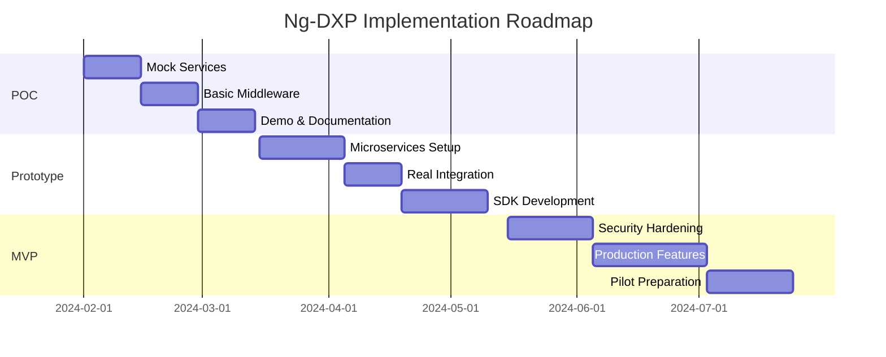

I've reviewed your proposal for the Ng-DXP (Nigerian Data Exchange Platform), and it's a solid foundation. Your approach of reverse-engineering Mono's consent-based model for government services is clever. Let me enhance your solution with some architectural improvements and practical considerations:

## 🎯 Enhanced Architecture Recommendations

### 1. **Event-Driven Architecture Enhancement**
Instead of just request-response patterns, implement an event-driven layer:
- **Event Bus**: Use Apache Kafka/Pulsar for real-time data synchronization
- **Change Data Capture (CDC)**: Track updates in source systems without constant polling
- **Webhooks**: Allow MDAs to subscribe to data changes

### 2. **Advanced Consent Management**
Building on your OAuth 2.0 approach:
```
Consent Levels:
- One-time access
- Time-bound access (e.g., 30 days)
- Recurring access with revocation
- Granular field-level consent (e.g., share NIN but not address)
```

### 3. **Data Federation Layer**
Add a virtual data layer that doesn't store data but provides:
- **GraphQL Federation**: Single query endpoint for complex cross-agency data
- **Data Virtualization**: Real-time data access without ETL
- **Caching Strategy**: Redis with smart invalidation based on data sensitivity

### 4. **Zero-Knowledge Proof Integration**
For sensitive validations without exposing actual data:
- "Is this person over 18?" → Yes/No (without revealing birthdate)
- "Does this person have sufficient funds?" → Yes/No (without revealing balance)

## 🔧 Technical Implementation Improvements

### API Gateway Enhancement
```yaml
Rate Limiting:
  - Per MDA quotas
  - Citizen-based throttling
  - Priority lanes for critical services (health, emergency)
  
Circuit Breaker:
  - Fallback to cached data
  - Graceful degradation
  - Auto-retry with exponential backoff
```

### Microservices Decomposition
```
Core Services:
├── consent-service (Keycloak + custom logic)
├── orchestration-service (workflow engine)
├── transformation-service (data mapping)
├── audit-service (immutable logs)
├── notification-service (SMS/email/push)
└── analytics-service (usage patterns)
```

### Data Connector Framework
Create a plugin architecture for easier integration:
```javascript
interface DataConnector {
  authenticate(): Promise<Token>
  fetchData(query: DataRequest): Promise<Response>
  mapSchema(source: any): StandardSchema
  validateResponse(data: any): ValidationResult
}
```

## 🚀 Implementation Strategy

### Phase 0: Foundation (Months 1-2)
- Set up development environment with GitOps
- Create connector SDK and documentation
- Build mock services for NIMC, CBN, NIBSS

### Phase 1: Core MVP (Months 3-4)
- Deploy basic consent management
- Implement 2 real connectors
- Basic audit logging with blockchain anchoring

### Phase 2: Scale (Months 5-6)
- Add 5+ agency connectors
- Implement advanced features (GraphQL, caching)
- Load testing for 1M+ requests/day

## 🛡️ Security Enhancements

### 1. **Hardware Security Module (HSM)**
- Store encryption keys in HSM
- Use for consent token signing
- Compliance with FIPS 140-2 Level 3

### 2. **API Security**
```
- Mutual TLS (mTLS) for service-to-service
- API key rotation every 90 days
- Request signing with HMAC-SHA256
- Implement OWASP API Security Top 10
```

### 3. **Privacy-Preserving Techniques**
- Differential privacy for analytics
- Homomorphic encryption for sensitive computations
- Data minimization by default

## 💡 Additional Features to Consider

### 1. **Offline Support**
- USSD-based consent for areas with poor internet
- SMS verification fallback
- Offline data verification using QR codes

### 2. **Interoperability Standards**
- Adopt international standards:
  - FHIR for health data
  - ISO 20022 for financial messages
  - OpenID Connect for identity

### 3. **Developer Experience**
```
SDK Features:
- Auto-generated clients (OpenAPI)
- Postman collections
- Interactive API playground
- Sandbox with realistic test data
```

## 📊 Monitoring & Operations

### Observability Stack
```
- Metrics: Prometheus + Grafana
- Logs: ELK Stack with correlation IDs
- Traces: Jaeger for distributed tracing
- SLIs/SLOs: 99.9% uptime, <200ms latency
```

## 🤝 Stakeholder Engagement

### Technical Advisory Board
Include representatives from:
- Banks (for payment integration expertise)
- Telcos (for USSD/SMS infrastructure)
- International partners (Estonia's X-Road, India's UPI)

### Pilot Selection Criteria
Start with MDAs that have:
- Modern IT infrastructure
- Clear use cases with citizen benefit
- Technical teams for integration support

Would you like me to:
1. Deep dive into any specific component?
2. Create detailed API specifications?
3. Develop a proof-of-concept for the consent management system?
4. Design the data connector framework with working examples?

The key to success will be starting simple, proving value quickly, and iterating based on real usage patterns. Your foundation is strong – these enhancements will make it enterprise-ready and future-proof.


## 🚀 Phased Implementation Guidelines: POC → Prototype → MVP

### 📍 **Phase 1: Proof of Concept (POC)** 
**Duration**: 4-6 weeks  
**Goal**: Prove the core consent-based data exchange concept works

#### Core Components
```yaml
1. Mock Services:
   - Fake NIMC API (returns hardcoded NIN data)
   - Fake CBN API (returns dummy account status)
   - Simple consent UI (basic web form)

2. Minimal Middleware:
   - Basic API Gateway (Express.js/FastAPI)
   - Simple consent storage (PostgreSQL)
   - Basic data transformer

3. Demo Application:
   - Single use case: NHIS verifying identity + payment status
```

#### Technical Implementation
```javascript
// POC Architecture (Monolithic for simplicity)
poc-middleware/
├── src/
│   ├── api/
│   │   ├── consent.js      // POST /consent, GET /consent/:id
│   │   └── data.js         // POST /data/request
│   ├── connectors/
│   │   ├── nimc-mock.js    // Hardcoded responses
│   │   └── cbn-mock.js     // Hardcoded responses
│   ├── services/
│   │   └── consent.js      // In-memory consent store
│   └── app.js              // Express server
├── demo-ui/                // Simple React app
└── docker-compose.yml      // Local development
```

#### Deliverables
1. **Working Demo** showing end-to-end flow:
   ```
   NHIS Portal → Request Data → Citizen Consent → Data Retrieved → Display Result
   ```

2. **Technical Documentation**:
   - API endpoints documentation
   - Sequence diagrams
   - 5-minute demo video

3. **Metrics**:
   - Response time < 2 seconds
   - 100% success rate with mock data

#### Success Criteria
- ✅ Complete data request flow works
- ✅ Consent is captured and validated
- ✅ Data from multiple sources is aggregated
- ✅ Stakeholders understand the value proposition

---

### 🔧 **Phase 2: Prototype**
**Duration**: 6-8 weeks  
**Goal**: Build a working system with real architectural patterns

#### Enhanced Architecture
```yaml
1. Microservices Separation:
   - API Gateway Service (Kong/Tyk)
   - Consent Service (with Keycloak)
   - Connector Service (plugin architecture)
   - Audit Service (with Elasticsearch)

2. Real Integrations:
   - 1 real government API (start with least sensitive)
   - Proper OAuth 2.0 flow
   - SMS/Email notifications

3. Basic Admin Portal:
   - MDA onboarding interface
   - Audit log viewer
   - Basic analytics dashboard
```

#### Technical Stack Evolution
```bash
prototype/
├── services/
│   ├── api-gateway/        # Kong with custom plugins
│   ├── consent-service/    # Node.js + Keycloak
│   ├── connector-service/  # Go microservice
│   ├── audit-service/      # Python + Elasticsearch
│   └── notification/       # Node.js + Twilio/local SMS
├── infrastructure/
│   ├── kubernetes/         # K8s manifests
│   ├── terraform/          # Cloud infrastructure
│   └── monitoring/         # Prometheus + Grafana
└── sdk/
    ├── connector-sdk/      # NPM package for building connectors
    └── client-sdk/         # SDK for MDAs
```

#### Key Features to Implement
```javascript
// Connector Plugin System
class ConnectorFramework {
  constructor() {
    this.connectors = new Map();
  }
  
  register(name, connector) {
    // Validate connector interface
    if (!connector.authenticate || !connector.fetchData) {
      throw new Error('Invalid connector interface');
    }
    this.connectors.set(name, connector);
  }
  
  async getData(source, query, credentials) {
    const connector = this.connectors.get(source);
    const auth = await connector.authenticate(credentials);
    return connector.fetchData(query, auth);
  }
}
```

#### Prototype Deliverables
1. **Multi-service deployment** on cloud (AWS/Azure)
2. **2-3 working connectors** (1 real, 2 mock)
3. **Basic SDK** for building new connectors
4. **Performance report**: Handle 100 requests/minute
5. **Security audit** findings and fixes

#### Success Criteria
- ✅ Successfully integrated with 1 real government API
- ✅ Consent management with revocation works
- ✅ Audit trail is searchable and tamper-proof
- ✅ 99% uptime during testing period

---

### 🎯 **Phase 3: MVP (Minimum Viable Product)**
**Duration**: 8-10 weeks  
**Goal**: Production-ready system for pilot deployment

#### Production Features
```yaml
1. Complete Security:
   - mTLS between services
   - API rate limiting per MDA
   - Encryption at rest and in transit
   - NDPR compliance checklist

2. Operational Excellence:
   - Blue-green deployment
   - Automated backups
   - Disaster recovery plan
   - 24/7 monitoring alerts

3. Advanced Features:
   - GraphQL API option
   - Webhook subscriptions
   - Batch processing
   - Data quality monitoring
```

#### MVP Architecture
```bash
mvp/
├── core-services/
│   ├── api-gateway/        # Kong + custom Lua plugins
│   ├── consent-mgmt/       # Keycloak + custom UI
│   ├── orchestration/      # Apache Airflow for workflows
│   ├── data-federation/    # GraphQL with Apollo
│   ├── audit-blockchain/   # Hyperledger for anchoring
│   └── analytics/          # Real-time dashboards
├── connectors/
│   ├── nimc-connector/     # Production NIMC integration
│   ├── cbn-connector/      # Production CBN integration
│   ├── nhis-connector/     # Production NHIS integration
│   └── template/           # Connector template
├── sdks/
│   ├── java-sdk/
│   ├── python-sdk/
│   ├── nodejs-sdk/
│   └── dotnet-sdk/
└── operations/
    ├── monitoring/         # Full observability stack
    ├── security/           # SIEM integration
    └── compliance/         # Audit reports
```

#### Production-Ready Features
```javascript
// Advanced Consent Management
const consentSchema = {
  id: 'uuid',
  citizen_id: 'nin_hash',
  requesting_mda: 'mda_id',
  data_scope: {
    sources: ['nimc', 'cbn'],
    fields: ['name', 'dob', 'account_status'],
    purpose: 'loan_verification',
    retention_days: 30
  },
  consent_type: 'one_time|recurring|conditional',
  expiry: 'timestamp',
  revocable: true,
  audit_trail: [{
    action: 'created|accessed|revoked',
    timestamp: 'iso_date',
    ip_address: 'masked_ip',
    user_agent: 'string'
  }]
};
```

#### MVP Deliverables
1. **Production deployment** with:
   - Load balancer + CDN
   - Multi-region setup
   - Automated CI/CD pipeline

2. **Complete documentation**:
   - API reference
   - Integration guides
   - Security whitepaper
   - Operations runbook

3. **Pilot-ready features**:
   - 3-5 working connectors
   - MDA self-service portal
   - Citizen consent dashboard
   - Real-time analytics

4. **Performance benchmarks**:
   - 10,000 requests/minute capacity
   - 99.9% uptime SLA
   - <100ms average latency

5. **Compliance package**:
   - NDPR compliance certificate
   - Security penetration test report
   - Data flow diagrams

#### Success Criteria
- ✅ Successfully onboarded 2-3 pilot MDAs
- ✅ Processed 10,000+ real transactions
- ✅ Zero security incidents
- ✅ Citizen satisfaction score > 80%
- ✅ Ready for national rollout

---

## 📊 Implementation Timeline Overview



## 🎬 Quick Start Guide for Each Phase

### POC Quick Start (Week 1)
```bash
# Clone and setup
git clone https://github.com/ng-dpic/ng-dxp-poc
cd ng-dxp-poc
docker-compose up -d

# Test the flow
curl -X POST http://localhost:3000/api/consent \
  -H "Content-Type: application/json" \
  -d '{"citizen_id":"12345","mda":"nhis","purpose":"verification"}'
```

### Prototype Quick Start (Month 2)
```bash
# Deploy to Kubernetes
kubectl apply -f k8s/namespace.yaml
kubectl apply -f k8s/services/
helm install kong stable/kong
./scripts/deploy-prototype.sh
```

### MVP Quick Start (Month 4)
```bash
# Production deployment
terraform init
terraform plan -out=tfplan
terraform apply tfplan
ansible-playbook -i inventory/production playbooks/deploy-mvp.yml
```

## 🔑 Key Success Factors

1. **Stakeholder Buy-in**: Weekly demos to NITDA
2. **Incremental Value**: Each phase delivers working software
3. **Fast Feedback**: 2-week sprints with retrospectives
4. **Security First**: Security review at each phase gate
5. **Documentation**: Keep docs updated as you build

Would you like me to:
1. Create detailed technical specifications for any phase?
2. Develop the POC codebase structure?
3. Design the API contracts for the prototype?
4. Prepare a pilot MDA onboarding checklist?

The key is to maintain momentum while building confidence with each successful phase completion.
